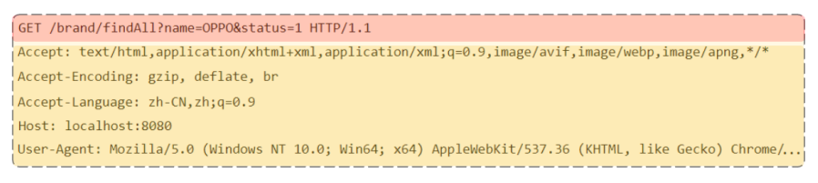
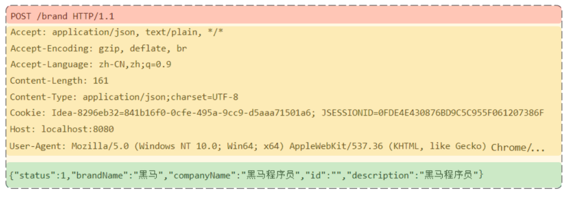
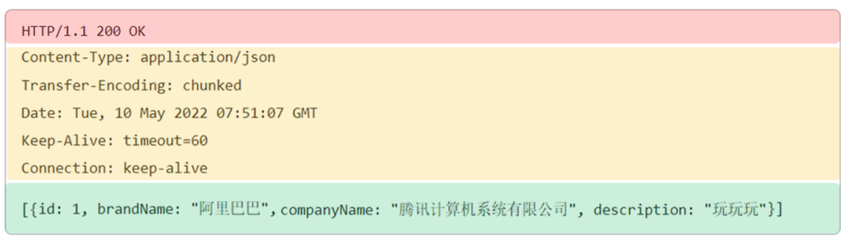

<p align="center">
   <a style="font-size:30px;"> 深入理解 HTTP </a>

</p>


# 1 HTTP 
HTTP：Hyper Text Transfer Protocol(超文本传输协议)规定了客户端和服务器之间通信的规则，包括请求的格式、响应的格式以及状态码等, 是一种基于**请求-响应**的协议

其实 HTTP 就是一种规范, 客户端和服务器之间数据交换的规范

[手写Http服务器](https://blog.csdn.net/qq_32099833/article/details/109397967)

<br>

# 2 HTTP 请求和响应数据的具体格式

## 2.1 HTTP 请求协议

GET 方法



POST 方法



## 2.2 HTTP 响应协议



1. 响应行（Response Line）: 响应数据的第一行, 包含**协议版本、响应状态码和状态码描述**
2. 响应头（Response Headers）: 响应数据的第二行开始, 格式为 key：value, 包含有关响应的元数据，如内容类型、内容长度等
3. 空行（Blank Line）: 用于分隔响应头和响应体
4. 响应体（Response Body）：包含实际的响应数据

下面是一个典型的 HTTP 响应的格式示例：

```
HTTP/1.1 200 OK
Content-Type: text/html
Content-Length: 123
Connection: keep-alive

<!DOCTYPE html>
<html>
<head>
    <title>Sample Page</title>
</head>
<body>
    <h1>Hello, world!</h1>
</body>
</html>
```
