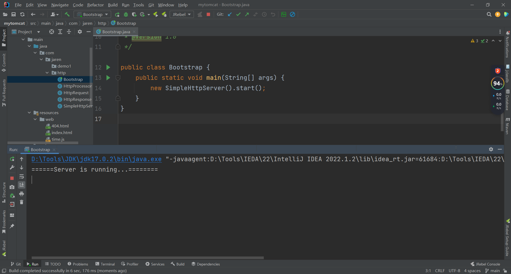
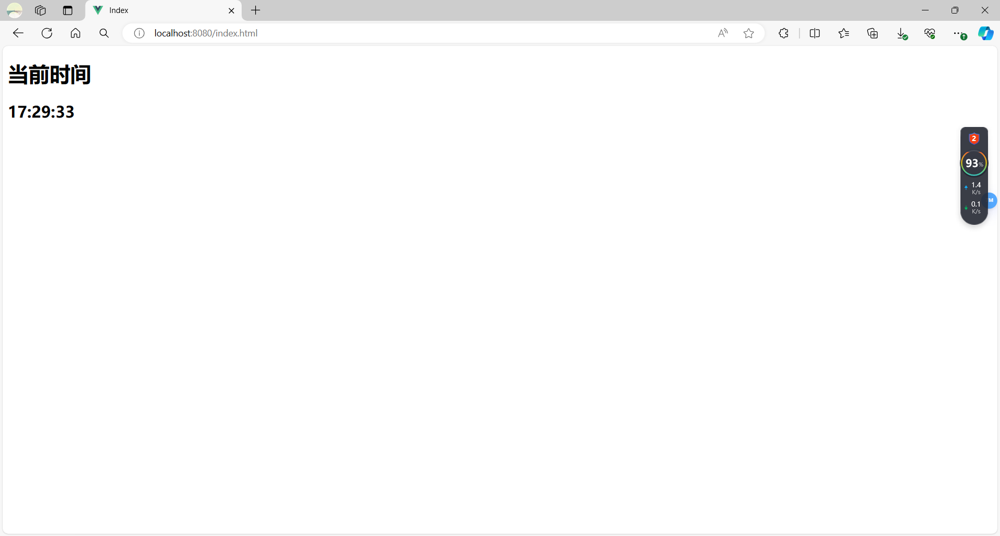
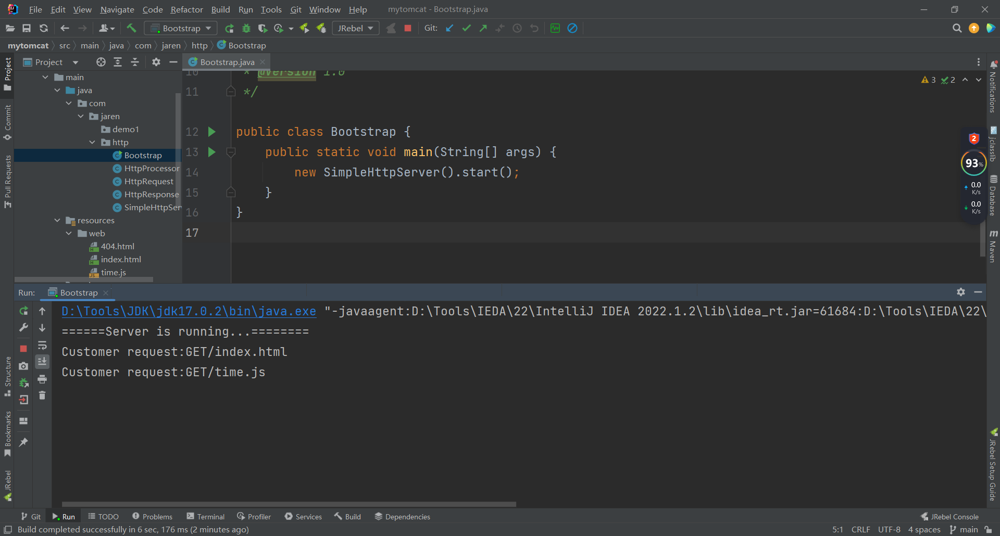

<p align="center">
   <a style="font-size:30px;"> 使用 Socket 编程实现的一个简易 HTTP 服务器 </a>

</p>


# 1 概述
本文使用 Java 的 ServerSocket 和 Socket 类, 实现一个简单的能处理 HTTP 请求的服务器, 理解 HTTP 解析过程

HTTP 定义了客户端和服务端之间数据交换的规范, 要实现一个 HTTP 服务器, 大致分为以下几个方面:
- 监听客户端请求
- 根据 HTTP 协议规范解析客户端的请求
- 处理请求业务
- 根据 HTTP 协议规范响应数据给客户端

<br>

# 2 ServerSocket 和 Socket 
使用方法: [Java 中 ServerSocket 与 Socket 的区别](https://blog.csdn.net/wwwjiahuan/article/details/60881489)

# 3 实现
## 3.1 HttpRequest 类, 解析客户端的请求

`getUri` 获取请求路径, `getMethod` 获取请求方式

```java
public class HttpRequest {
    
    private String uri;
    private String method;
    
    public HttpRequest(InputStream inputStream) {
        try {
            BufferedReader read = new BufferedReader(new InputStreamReader(inputStream, "UTF-8"));
            String line = read.readLine(); 
            if (line != null) {
                String[] data = line.split(" ");
                if (data.length >= 2) {
                    this.method = data[0];
                    this.uri = data[1];
                }
            }
        } catch (UnsupportedEncodingException e) {
            e.printStackTrace();
        } catch (IOException e) {
            e.printStackTrace();
        }
    }


    public String getUri() {
        return uri;
    }

    public String getMethod() {
        return method;
    }
}

```

## 3.2 HttpResponse 类, 构建生成响应数据的模型

```java
public class HttpResponse {
    
    public OutputStream outputStream;

    public void write(String s){
        try {
            outputStream.write(s.getBytes());
        } catch (IOException e) {
            e.printStackTrace();
        }
    }

    public HttpResponse(OutputStream outputStream) {
        this.outputStream = outputStream;
    }
}
```


## 3.3 HttpProcessor 类, 处理客户端请求

以请求一个 HTML 页面为例, 我们需要定位到资源文件的位置, 再按照 HTTP 协议格式构造响应数据

当响应是 HTML 文件时，将内容以字符串的形式写入到 HTTP **响应体**中, 这样浏览器可以正确解析 HTML 并将其呈现出来

```java
public class HttpProcessor {
    // HTTP服务根目录
    private static final String ROOT_DIR = System.getProperty("user.dir") + File.separator +"src\\main\\resources"+ File.separator + "web";

    public void process(HttpRequest request, HttpResponse response) throws IOException {
        String uri = request.getUri();
        File file = new File(ROOT_DIR, uri);
        if (file.exists()) {
            byte[] fileContent = Files.readAllBytes(file.toPath());
            response.write("HTTP/1.1 200 OK\n");
            response.write("content-length: " + file.length() + "\n\n");
            response.write(new String(fileContent, Charset.defaultCharset()));
        }else {
            // 文件不存在，返回404页
            file = new File(ROOT_DIR, "404.html");
            byte[] fileContent = Files.readAllBytes(file.toPath());
            response.write("HTTP/1.1 404 Not Found\n");
            response.write("content-length: " + file.length() + "\n\n");
            response.write(new String(fileContent, Charset.defaultCharset()));
        }
    }
}
```

## 3.4 SimpleHttpServer 类，负责接收客户端的请求, 并交由处理器去处理

在 8080 端口创建一个 ServerSocket 对象, 用于监听客户端的连接请求

`Socket socket = serverSocket.accept();` 当有客户端连接请求到达时, `accept()` 方法将返回一个新的 Socket 对象, 代表与客户端建立的连接

从客户端的 Socket 输入流中读取 HTTP 请求数据, 经过解析-处理-响应, 将响应数据给到客户端的 Socket 输出流

```java
public class SimpleHttpServer implements Runnable {

    public void start() {
        new Thread(this).start();
    }

    @Override
    public void run() {
        try {
            ServerSocket serverSocket = new ServerSocket(8080);
            System.out.println("======Server is running...========");
            while (!serverSocket.isClosed()) {
                Socket socket = serverSocket.accept();

                // 当有客户端请求过来，为连接创建Request和Response对象
                HttpRequest request = new HttpRequest(socket.getInputStream());
                System.out.println("Customer request:" + request.getMethod() + request.getUri());
                HttpResponse response = new HttpResponse(socket.getOutputStream());

                // 交给处理器去处理
                HttpProcessor processor = new HttpProcessor();
                processor.process(request, response);

                socket.shutdownOutput();
            }
        } catch (Exception e) {
            e.printStackTrace();
        }
    }
}
```

# 4 演示

这就实现了一个非常简单的单线程 HTTP 服务器, 它能够接受客户端的连接请求, 并根据客户端的请求生成相应的响应

启动服务



发起请求


日志打印


# 5 Reference 

[手写 Http 服务器](https://blog.csdn.net/qq_32099833/article/details/109397967)

[Java 中 ServerSocket 与 Socket 的区别](https://blog.csdn.net/wwwjiahuan/article/details/60881489)

