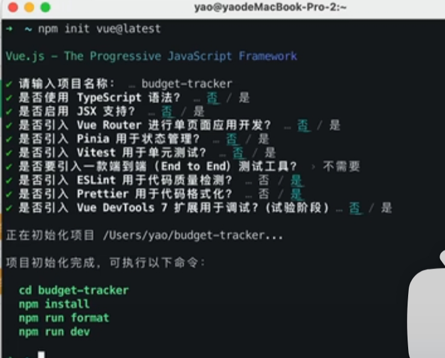

# 教程
[创建一个 Vue 应用](https://cn.vuejs.org/examples/)

(https://blog.csdn.net/zhangliwen1101/article/details/141021498)

(https://blog.csdn.net/weixin_44882488/article/details/124220864)


# 问题
```bash
D:\MyGitProject\frontend>npm create vue@latest
npm error code ETIMEDOUT
npm error errno ETIMEDOUT
npm error network request to https://registry.npmjs.org/create-vue failed, reason:
npm error network This is a problem related to network connectivity.
npm error network In most cases you are behind a proxy or have bad network settings.
npm error network
npm error network If you are behind a proxy, please make sure that the
npm error network 'proxy' config is set properly.  See: 'npm help config'
npm error A complete log of this run can be found in: C:\Users\48055\AppData\Local\npm-cache\_logs\2024-08-17T15_13_24_341Z-debug-0.log
```

请求超时

更换 npm 源
如果 npm 官方源访问不稳定，可以尝试更换为淘宝镜像源：
```bash
npm config set registry https://registry.npmmirror.com
```


# 流程总结



components下所有问文件删除

main.css只保留 @import './base.css';

App.vue 清空
