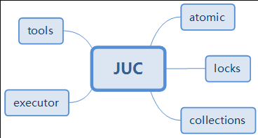

   <a style="font-size:30px;"> Java 并发编程知识总结 </a>

---
[JAVA并发编程知识总结（全是干货超详细）](https://zhuanlan.zhihu.com/p/362843892)

<https://pdai.tech/md/java/thread/java-thread-x-overview.html>

<https://javaguide.cn/java/concurrent/optimistic-lock-and-pessimistic-lock.html>

---

# 再看并发编程三个重要特性
## 原子性
一次操作或者多次操作，要么所有的操作全部都得到执行并且不会受到任何因素的干扰而中断，要么都不执行。在 Java 中，可以借助synchronized、各种 Lock 以及各种原子类实现原子性。synchronized 和各种 Lock 可以保证任一时刻只有一个线程访问该代码块，因此可以保障原子性。各种原子类是利用 CAS (compare and swap) 操作（可能也会用到 volatile或者final关键字）来保证原子操作。

## 可见性
当一个线程对共享变量进行了修改，那么另外的线程都是立即可以看到修改后的最新值。在 Java 中，可以借助synchronized、volatile 以及各种 Lock 实现可见性。如果我们将变量声明为 volatile ，这就指示 JVM，这个变量是共享且不稳定的，每次使用它都到主存中进行读取。

## 有序性
由于指令重排序问题，代码的执行顺序未必就是编写代码时候的顺序。我们上面讲重排序的时候也提到过：指令重排序可以保证串行语义一致，但是没有义务保证多线程间的语义也一致 ，所以在多线程下，指令重排序可能会导致一些问题。在 Java 中，volatile 关键字可以禁止指令进行重排序优化。

# 多线程并发编程基础
Java 并发 - 线程基础

锁

synchronized  volatile final

## JMM（Java 内存模型）
Reference:
- [JavaGuide JMM（Java 内存模型）详解](https://javaguide.cn/java/concurrent/jmm.html)
---

线程池

# JUC (java.util.concurrent 包)
Reference:
- [java--JUC快速入门（彻底搞懂JUC）](https://blog.csdn.net/weixin_43888181/article/details/116546374)
---

## tools

## locks
AQS 的全称为 AbstractQueuedSynchronizer

## atomic
并发包 java.util.concurrent 的原子类都存放在java.util.concurrent.atomic下

## collections

CompletableFuture 详解

## executor

# Java 并发 - ThreadLocal

# 虚拟线程极简入门(Java 21)

