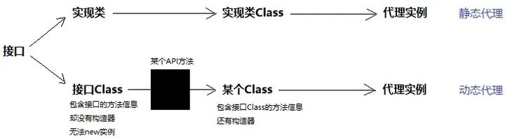
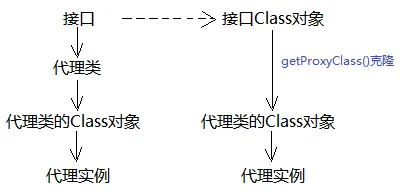

   <a style="font-size:30px;"> 浅谈JDK动态代理 </a>

# 静态代理
静态代理的问题：

上面的代码中，为了给目标类做日志增强，我们编写了代理类，而且准备了一个构造器接收目标对象。代理代理对象构造器的参数类型是Calculator，这意味着它只能接受Calculator的实现类对象，亦即我们写的代理类CalculatorProxy只能给Calculator做代理，它们绑定死了！

但静态代理本质上并没有太大用处，它只是把原本在源程序上做的修改，转移到代理类而已！即便引入静态代理，仍旧需要重写全部方法、仍然存在重复的日志代码。

# 动态代理

## 如何不写代理类，直接得到Class对象

代理类和实例对象之间其实还隔着一个Class对象。如果能得到Class对象，就能生成实例。

反射中我们知道，如果事先有类，Java提供了创建Class对象的方法，底层会告诉JVM帮我们创建Class对象：
1. Class.forName(xxx)：Class<Person> clazz = Class.forName("com.bravo.Person");
2. xxx.class：Class<Person> clazz = Person.class;
3. xxx.getClass()：Class<Person> clazz = person.getClass();

所以，现在的问题又变成：如何不写代理类，直接得到Class对象。

## 我们对代理对象有什么需求？

造一个代理对象需要哪些信息：

- 类的方法信息

如何知道一个类有哪些方法信息呢？

- 通过目标类实现的接口（JDK动态代理）

## 怎么根据一个接口得到代理对象：JDK动态代理

接口确实包含我们所需要的方法信息，但接口缺少构造器信息不能直接new对象。那么，是否存在一种机制，能给接口安装上构造器呢？或者，不改变接口本身，直接拷贝接口的信息到另一个Class，然后给那个Class装上构造器呢？

**JDK动态代理的本质是：用Class造Class，即用接口Class造出一个代理类Class。**

Proxy.getProxyClass()：返回代理类的Class对象。

也就说，只要传入接口的Class对象，getProxyClass()方法即可返回代理Class对象，而不用实际编写代理类。

直接跳过了代理类的编写！