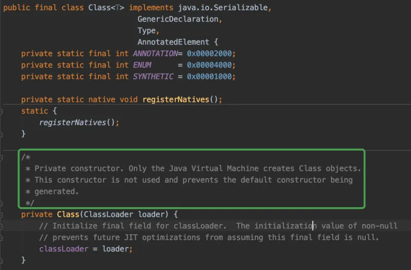
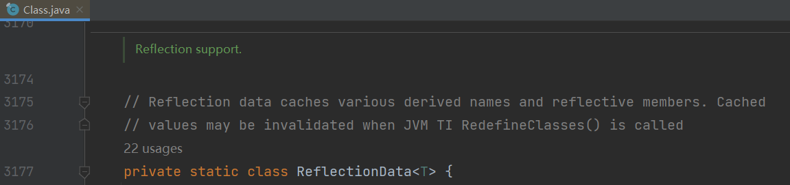

<p align="center">
   <a style="font-size:30px;"> 再谈反射 </a>

</p>

https://www.yuque.com/bravo1988/java/xswa26


---

反射的实现首先基于Java类加载机制。

针对于编写好的.java源文件进行编译（使用`javac.exe`），会生成一个或多个.class字节码文件。接着，我们使用`java.exe`命令对指定的.class文件进行解释运行。这个解释运行的过程中，我们需要将.class字节码文件加载（使用类的加载器）到内存中（存放在方法区）。加载到内存中的.class文件对应的结构即为Class的一个实例。

说明：运行时类在内存中会缓存起来，在整个执行期间，只会加载一次。

一个class类包含构造器,方法,字段属性,接口等信息,他们在二进制中的形式就是01串,然后class对象是描述这些字节码的类,所以源码中包含了注解,接口等字段,也包含了Method，Field,Constructor等，方法，字段，构造器包含的信息有很多，所以jdk设计师他们又创建了三个类来描述他们，值得一提的是，class类的构造器是私有的，避免了人为new一个class对象来描述class文件，只能通过jvm使用类加载器才能创建，然后有了class对象就可以使用newInstance创建实例了，这也是反射的第一个用途。


# JVM创建实例的过程
```java
A a = new A();
```
创建对象a的和过程大致如下：

通过new创建实例和反射创建实例，都绕不开Class对象。

# 类加载器
[好怕怕的类加载器](https://zhuanlan.zhihu.com/p/54693308)

# Class类



我们发现：
- Class类是泛型类
- Class类私有构造，意味着我们无法通过new关键字自行构造Class对象

虽然不能new，但Java还是提供了其他方式让我们得到Class对象，底层会告诉JVM帮我们创建：
1. Class.forName(xxx)：Class<Person> clazz = Class.forName("com.bravo.Person");
2. xxx.class：Class<Person> clazz = Person.class;
3. xxx.getClass()：Class<Person> clazz = person.getClass();




```java
 private static class ReflectionData<T> {
        volatile Field[] declaredFields;
        volatile Field[] publicFields;
        volatile Method[] declaredMethods;
        volatile Method[] publicMethods;
        volatile Constructor<T>[] declaredConstructors;
        volatile Constructor<T>[] publicConstructors;
        // Intermediate results for getFields and getMethods
        volatile Field[] declaredPublicFields;
        volatile Method[] declaredPublicMethods;
        volatile Class<?>[] interfaces;

        // Cached names
        String simpleName;
        String canonicalName;
        static final String NULL_SENTINEL = new String();

        // Value of classRedefinedCount when we created this ReflectionData instance
        final int redefinedCount;

        ReflectionData(int redefinedCount) {
            this.redefinedCount = redefinedCount;
        }
    }

```

# 反射API
## 通过反射创建实例
```java
Class<Person> clazz = Person.class;
Person p1 = clazz.newInstance();

```
clazz.newInstance()底层还是调用Contructor对象的newInstance()，所以，要想调用clazz.newInstance()，必须保证编写类的时候有个无参构造，否则就要先获取对应的Constructor。


## 调用属性
```java
        //public int age;
        Field ageField = clazz.getField("age");
        ageField.set(p1,10);
        System.out.println(ageField.get(p1));
```

## 调用方法
```java
        //public void show()
        Method showMethod = clazz.getMethod("show");
        showMethod.invoke(p1);
```