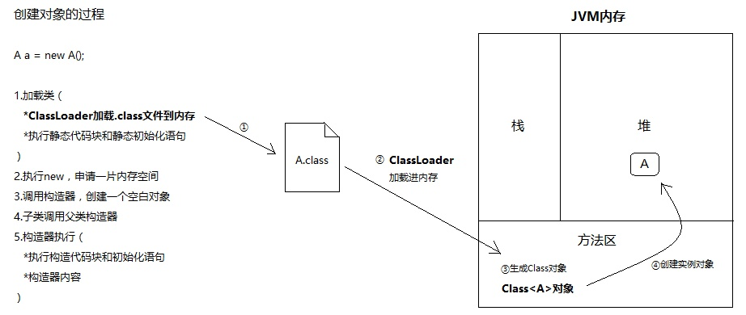
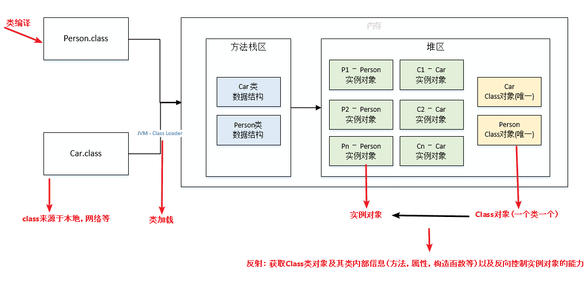

<p align="center">
   <a style="font-size:30px;"> 反射 </a>

</p>

# 1 引言
## 1.1 Class 类

通过 `new` 创建实例和反射创建实例，都绕不开 Class 对象。反射实现的本质是拿到 Class 对象。

对编写好的 `.java` 源文件进行编译(使用 `javac.exe`)，会生成一个或多个 `.class` 字节码文件。接着，我们使用 `java.exe` 命令对指定的 `.class` 文件进行解释运行。这个解释运行的过程中，我们需要将 `.class` 字节码文件加载(使用类的加载器)到内存中(存放在方法区)。加载到内存中的 `.class` 文件对应的结构即为 Class 的一个实例。

创建对象的过程：



类的加载：




## 1.2 静态编译
在程序执行之前，将源代码编译成机器代码（即可执行代码），并将其保存为二进制文件的过程就是静态编译。编译器在编译时会检查类型并执行类型检查，确定程序的结构，包括方法、属性等，而不会在运行时进行修改，并确保代码的类型安全性。

然而，有时候我们需要在运行时动态地操作类、方法、属性等，而静态编译无法满足这种需求。这就引入了反射机制。反射机制是 Java 提供的一种能够在运行时检查、检索和操作类、方法、属性、构造器等的能力。

## 1.3 反射的作用
**调用二进制文件**

来自网络等途径的二进制 `.class` 文件，没有其 `.java` 源文件，无法使用 `new` 来实例化对象。通过反射，可以在运行时动态地加载、创建和调用未知类型的对象，从而处理来自网络或其他来源的未知类。

**动态加载**（体现 Java 的灵活性，并降低类的耦合性：多态）

有的类可以在用到时再动态加载到 JVM 中，这样可以减少 JVM 的启动时间，同时可以动态加载需要的对象（多态）。例如：在切面编程（AOP）中，需要拦截特定的方法，通常会选择动态代理方式，这就需要反射技术来实现了。

**开发通用框架**（避免写死）
    
反射最重要的用途就是开发各种通用框架。很多框架（比如 Spring）都是配置化的（比如通过 XML 文件配置 JavaBean、Filter 等），为了保证框架的通用性，它们可能需要根据配置文件加载不同的对象或类，调用不同的方法，这个时候就必须用到反射——运行时动态加载需要加载的对象。

**处理注解**

<br>

# 2 反射的使用

开发中使用反射的目的主要是创建实例，调用方法、属性。

- 获取 Class 实例 -> 创建类的实例 -> 获取/调用当前运行时类中声明的所有方法/属性。

下面展示了一个简单的测试用例，每一过程的原理和其他实现方法不在此一一列出。更多结合源码和[浅谈反射机制](https://zhuanlan.zhihu.com/p/66853751)以及[Java 基础 - 反射机制详解](https://pdai.tech/md/java/basic/java-basic-x-reflection.html)等资料理解。

```java
    public void test1() throws
            NoSuchMethodException, InvocationTargetException,
            InstantiationException, IllegalAccessException, NoSuchFieldException {
        //获取 Class 实例(调用运行时类的静态属性：class)
        Class clazz = Person.class;

        //Person p = (Person) clazz.newInstance();
        //调用私有的构造器，创建 Person 的实例
        //private Person(String name, int age)
        Constructor cons = clazz.getDeclaredConstructor(String.class, int.class);
        cons.setAccessible(true);
        Person p = (Person) cons.newInstance("Tom", 12);
        System.out.println(p);

        //通过 Class 实例调用 getDeclaredField(String fieldName)，获取运行时类指定名的属性
        Field infoField = clazz.getDeclaredField("info");
        //setAccessible(true)：确保此属性是可以访问的
        infoField.setAccessible(true);
        //通过 Filed 类的实例调用 get(Object obj) （获取的操作）
        // 或 set(Object obj,Object value) （设置的操作）进行操作。
        infoField.set(p, "Person");
        System.out.println(infoField.get(p));

        //通过 Class 的实例调用 getDeclaredMethod(String methodName,Class ... args),获取指定的方法
        Method showNationMethod = clazz.getDeclaredMethod("showNation", String.class,int.class);
        //setAccessible(true)：确保此方法是可访问的
        showNationMethod.setAccessible(true);
        //通过 Method 实例调用 invoke(Object obj,Object ... objs),即为对 Method 对应的方法的调用
        //invoke() 的返回值即为 Method 对应的方法的返回值，特别的：如果 Method 对应的方法的返回值类型为 void，则 invoke() 返回值为 null
        Object returnValue = showNationMethod.invoke(p, "CHN",10);
        System.out.println(returnValue);
    }

```

# Reference
https://blog.csdn.net/tongdanping/article/details/103252352

https://pdai.tech/md/java/basic/java-basic-x-reflection.html