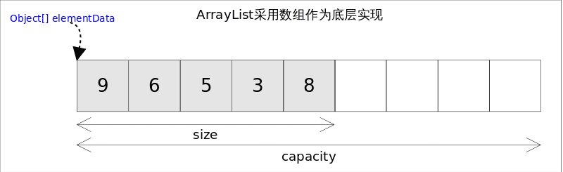

<p style="font-size:30px;">Java-Collection_Map</p>


---

Java容器里只能放对象，对于基本类型(int, long, float, double等)，需要将其包装成对象类型后(Integer, Long, Float, Double等)才能放到容器里。很多时候拆包装和解包装能够自动完成。这虽然会导致额外的性能和空间开销，但简化了设计和编程。


---

<p style="font-size:20px;">目录</p>

<!-- TOC -->

- [1 集合框架概述](#1-集合框架概述)
    - [Java 集合框架体系](#java-集合框架体系)
- [2 Collection 接口及方法](#2-collection-接口及方法)
    - [List接口(对付顺序的好帮手): 存储的元素是有序的、可重复的](#list接口对付顺序的好帮手-存储的元素是有序的可重复的)
        - [ArrayList](#arraylist)
        - [LinkedList --是一个双向链表（只是没有用 DoubleLinkedList 这个类名）](#linkedlist---是一个双向链表只是没有用-doublelinkedlist-这个类名)
        - [Vector](#vector)
    - [Set接口(注重独一无二的性质): 存储的元素不可重复的。](#set接口注重独一无二的性质-存储的元素不可重复的)
        - [TreeSet](#treeset)
        - [HashSet](#hashset)
        - [LinkedHashSet](#linkedhashset)
    - [Queue接口(实现排队功能的叫号机)](#queue接口实现排队功能的叫号机)
        - [LinkedList](#linkedlist)
        - [PriorityQueue](#priorityqueue)
- [3 Map接口](#3-map接口)
    - [Map接口(用 key 来搜索的专家)](#map接口用-key-来搜索的专家)
        - [HashMap](#hashmap)
        - [LinkedHashMap](#linkedhashmap)
        - [Hashtable](#hashtable)
        - [TreeMap](#treemap)
- [4 Iterator(迭代器)接口](#4-iterator迭代器接口)
    - [Iterator](#iterator)

<!-- /TOC -->


# 1 集合框架概述
数组在内存存储方面的特点：
* 数组初始化以后，长度就确定了。
* 数组中的添加的元素是依次紧密排列的，有序的，可以重复的。
* 数组声明的类型，就决定了进行元素初始化时的类型。不是此类型的变
量，就不能添加。
* 可以存储基本数据类型值，也可以存储引用数据类型的变量

数组在存储数据方面的弊端：
* 数组初始化以后，长度就不可变了，不便于扩展
* 数组中提供的属性和方法少，不便于进行添加、删除、插入、获取元素个
数等操作，且效率不高。
* 数组存储数据的特点单一，只能存储有序的、可以重复的数据


## Java 集合框架体系

Java 集合框架中的类可以用于存储多个对象，还可用于保存具有映射关系的关联数组。

Java 集合可分为 Collection 和 Map 两大体系：
* Collection 接口：用于存储一个一个的数据，也称单列数据集合。

        List 子接口：用来存储有序的、可以重复的数据（主要用来替换数组，"动态"数组）
            实现类：ArrayList(主要实现类)、LinkedList、Vector

        Set 子接口：用来存储无序的、不可重复的数据（类似于高中讲的"集合"）
            实现类：HashSet(主要实现类)、LinkedHashSet、TreeSet

        Queue

* Map 接口：用于存储具有映射关系“key-value 对”的集合，即一对一对的数据，也称双列数据集合。(类似于高中的函数、映射。(x1,y1),(x2,y2) ---> y = f(x) )

        HashMap(主要实现类)、LinkedHashMap、TreeMap、Hashtable、Properties

# 2 Collection 接口及方法
<a href="https://javaguide.cn/java/collection/java-collection-questions-01.html" target="_blank">Java集合常见面试题总结————JavaGuide</a>

## List接口(对付顺序的好帮手): 存储的元素是有序的、可重复的
```
// 继承于 Collection
public interface List<E> extends Collection<E> {}
```
### ArrayList
基于动态数组实现（自动扩容），支持随机访问。线程不安全。不需要线程安全的特性，推荐使用 ArrayList，因为它在大多数情况下具有更好的性能。



自动扩容：

每当向数组中添加元素时，都要去检查添加后元素的个数是否会超出当前数组的长度，如果超出，数组将会进行扩容，以满足添加数据的需求。数组扩容通过一个公开的方法ensureCapacity(int minCapacity)来实现。在实际添加大量元素前，我也可以使用ensureCapacity来手动增加ArrayList实例的容量，以减少递增式再分配的数量。数组进行扩容时，会将老数组中的元素重新拷贝一份到新的数组中，每次数组容量的增长大约是其原容量的1.5倍。这种操作的代价是很高的，因此在实际使用时，我们应该尽量避免数组容量的扩张。当我们可预知要保存的元素的多少时，要在构造ArrayList实例时，就指定其容量，以避免数组扩容的发生。或者根据实际需求，通过调用ensureCapacity方法来手动增加ArrayList实例的容量。

扩容操作最终是通过grow()方法完成的。

```
public class ArrayList<E> 
    extends AbstractList<E>
    implements List<E>, RandomAccess, Cloneable, java.io.Serializable {}
```

```
// Creating an object of List interface
// implemented by the ArrayList class
// 多态性
List<Integer> l1 = new ArrayL   ist<Integer>();
ArrayList<Integer> l11 = new ArrayList<Integer>();
// 虽然 ArrayList 实现了多个接口，但 List 接口是其中一个核心接口，它提供了对列表的常见操作和方法。从列表操作的角度来看，这两种方式是等效的。
```

Fail-Fast 机制：

定义：Fail-Fast 机制是指在使用迭代器遍历集合对象（如 ArrayList）时，如果该集合在迭代过程中被修改了（除了迭代器自身的 remove 方法外），迭代器会立即抛出一个 ConcurrentModificationException 异常。这种机制能够尽早发现问题，避免不确定的行为。

实现原理：ArrayList 内部有一个 modCount 变量，用于记录集合的修改次数。每当集合被修改（添加、删除、修改等操作），这个计数器就会增加。当迭代器创建时，它会记录下当时的 modCount 值。在迭代过程中，如果检测到 modCount 的当前值与迭代器记录的值不同，就会抛出 ConcurrentModificationException。

目的：这个机制的目的是为了避免不一致的视图，确保数据的准确性。在多线程环境下，如果多个线程同时修改同一个集合，可能会导致数据的不一致或其他未定义的行为。通过 Fail-Fast 机制，可以尽早地发现并发修改异常。

局限性：Fail-Fast 机制并不是完全可靠的，在单线程环境下它工作得很好，但在多线程环境下，它不能保证正确地检测到所有的并发修改。此外，这个机制并不会阻止并发修改本身，而是在检测到并发修改后产生一个错误。

应对并发修改：对于需要在多线程环境中操作 ArrayList 的场景，建议使用线程安全的集合类，如 Vector 或 CopyOnWriteArrayList，或者使用适当的同步控制来确保 ArrayList 的线程安全。

### LinkedList --是一个双向链表（只是没有用 DoubleLinkedList 这个类名）
基于双向链表实现，只能顺序访问，但是可以快速地在链表中间插入和删除元素。不仅如此，LinkedList 还可以用作栈、队列和双向队列。（现在栈或队列，首选是ArrayDeque）

LinkedList的实现方式决定了所有跟下标相关的操作都是线性时间，而在首段或者末尾删除元素只需要常数时间。为追求效率LinkedList没有实现同步(synchronized)，如果需要多个线程并发访问，可以先采用Collections.synchronizedList()方法对其进行包装。    

```
public class LinkedList<E> 
    extends Abstract SequentialList<E>
    implements List<E>, Deque<E>, Cloneable, java.io.Serializable {}
```

### Vector
线程安全
```
public class Vector<E>
    extends AbstractList<E>
    implements List<E>, RandomAccess, Cloneable, java.io.Serializable {}
``` 

## Set接口(注重独一无二的性质): 存储的元素不可重复的。
### TreeSet
基于红黑树实现，支持有序性操作，例如根据一个范围查找元素的操作。但是查找效率不如 HashSet，HashSet 查找的时间复杂度为 O(1)，TreeSet 则为 O(logN)。

### HashSet
基于哈希表实现，支持快速查找，但不支持有序性操作。并且失去了元素的插入顺序信息，也就是说使用 Iterator 遍历 HashSet 得到的结果是不确定的。

### LinkedHashSet
具有 HashSet 的查找效率，且内部使用双向链表维护元素的插入顺序。


## Queue接口(实现排队功能的叫号机)
### LinkedList
可以用它来实现双向队列。

### PriorityQueue
基于堆结构实现，可以用它来实现优先队列。优先队列的作用是能保证每次取出的元素都是队列中权值最小的(Java的优先队列每次取最小元素，C++的优先队列每次取最大元素)。


# 3 Map接口
## Map接口(用 key 来搜索的专家)
使用键值对（key-value）存储，类似于数学上的函数 y=f(x)，"x" 代表 key，"y" 代表 value，key 是无序的、不可重复的，value 是无序的、可重复的，每个键最多映射到一个值

```
public interface Map<K, V> {}
```

### HashMap
基于哈希表实现
```
public class HashMap<K,V> 
    extends AbstractMap<K,V>
    implements Map<K,V>, Cloneable, Serializable {}
```

### LinkedHashMap
LinkedHashMap使用双向链表来维护元素的顺序，顺序为插入顺序或者最近最少使用(LRU)顺序。

### Hashtable
和 HashMap 类似，但它是线程安全的，这意味着同一时刻多个线程可以同时写入 HashTable 并且不会导致数据不一致。它是遗留类，不应该去使用它。现在可以使用 ConcurrentHashMap 来支持线程安全，并且 ConcurrentHashMap 的效率会更高，因为 ConcurrentHashMap 引入了分段锁。

### TreeMap
基于红黑树实现


# 4 Iterator(迭代器)接口

## Iterator
与Collection、Map 接口有所不同
* Collection 接口与 Map 接口主要用于存储元素
* Iterator，被称为迭代器接口，本身并不提供存储对象的能力，主要用于
遍历 Collection 中的元素


