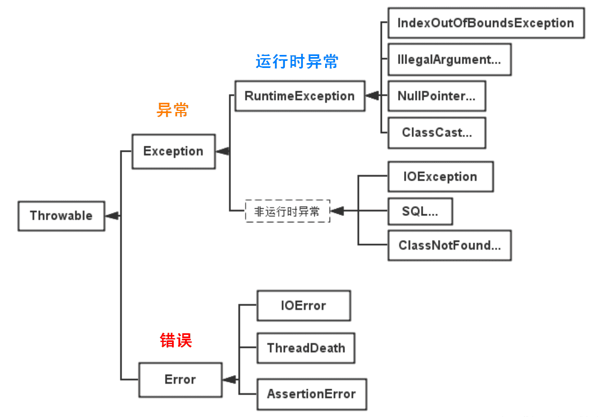

<p style="font-size:30px;">Java-Exception</p>
Java 异常都是对象，是 Throwable 子类的实例，描述了出现在一段编码中的错误条件。当条件生成时，错误将引发异常。


---

References

https://pdai.tech/md/java/basic/java-basic-x-exception.html

---

<p style="font-size:20px;">目录</p>

<!-- TOC -->

- [如何对待异常](#如何对待异常)
- [异常的体系结构](#异常的体系结构)
- [异常的捕获](#异常的捕获)
- [2 异常处理一 捕获异常 try-catch-finally](#2-异常处理一-捕获异常-try-catch-finally)
  - [抓抛模型](#抓抛模型)
  - [使用细节](#使用细节)
  - [finally](#finally)
    - [fianally 基本使用](#fianally-基本使用)
    - [fianally 使用场景](#fianally-使用场景)
    - [final finally finalize](#final-finally-finalize)
- [3 异常处理二 throws + 异常类型](#3-异常处理二-throws--异常类型)

<!-- /TOC -->

# 如何对待异常
 对于程序出现的异常，一般有两种解决方法：一是遇到错误就终止程序的运行。另一种方法是程序员在编写程序时，就充分考虑到各种可能发生的异常和错误，极力预防和避免。实在无法避免的，要编写相应的代码进行异常的检测、以及`异常的处理`，保证代码的`健壮性`。

 异常的抛出机制
 
Java中把不同的异常用不同的类表示，一旦发生某种异常，就`创建该异常类型的对象`，并且抛出（throw）。<br>
然后程序员可以捕获(catch)到这个异常对象，并处理；如果没有捕获(catch)这个异常对象，那么这个异常对象将会导致程序终止。<br>

# 异常的体系结构

java.lang.Throwable:异常体系的根父类，分为Error和Exception<br>

    |---java.lang.Error:错误。Java虚拟机无法解决的严重问题。如：JVM系统内部错误、资源耗尽等严重情况。一般不编写针对性的代码进行处理。
               |---- StackOverflowError（栈内存溢出）
               |---- OutOfMemoryError（堆内存溢出OOM）

    |---java.lang.Exception:异常。编程错误、偶然外在因素导致的一般性问题。我们可以编写针对性的代码进行处理。
               |----编译时异常：(受检异常)
                    |----- ClassNotFoundException
                    |----- FileNotFoundException
                    |----- IOException
               |----运行时异常：(非受检异常)在执行java.exe命令时，出现的异常。
                    |---- ArrayIndexOutOfBoundsException
                    |---- NullPointerException
                    |---- ClassCastException
                    |---- NumberFormatException
                    |---- InputMismatchException
                    |---- ArithmeticException


<br>
<a href="https://www.runoob.com/manual/jdk11api/java.base/java/lang/Throwable.html" target="_blank">具体参考API</a><br>


The Java Language Specification calls any exceptions that derives from the class `Error` or class `RuntimeException` an `unchecked` exception. All other exceptions are called `checked` exceptions.

# 异常的捕获
异常捕获处理的方法通常有：

try-catch
try-catch-finally
try-finally
try-with-resource
try-catch

# 2 异常处理一 捕获异常 try-catch-finally

## 抓抛模型
过程1：“抛”
* 程序在执行的过程当中，一旦出现异常，就会在出现异常的代码处，生成对应异常类的对象，并将此对象抛出。
* 一旦抛出，此程序就不执行其后的代码了。<br>

过程2：“抓”
* 针对于过程1中抛出的异常对象，进行捕获处理。此捕获处理的过程，就称为抓。
* 一旦将异常进行了处理，代码就可以继续执行。
```
try{
	......	//可能产生异常的代码
}
catch( 异常类型1 e ){
	......	//当产生异常类型1型异常时的处置措施
}
catch( 异常类型2 e ){
	...... 	//当产生异常类型2型异常时的处置措施
}
finally{
	...... //无论是否发生异常，都无条件执行的语句
}
```

## 使用细节
将可能出现异常的代码声明在try语句中。一旦代码出现异常，就会自动生成一个对应异常类的对象。并将此对象抛出。<br>

针对于try中抛出的异常类的对象，使用之后的catch语句进行匹配。一旦匹配上，就进入catch语句块进行处理。一旦处理接触，代码就可继续向下执行。<br>
  
如果声明了多个catch结构，不同的异常类型在不存在子父类关系的情况下，谁声明在上面，谁声明在下面都可以。如果多个异常类型满足子父类的关系，则必须将子类声明在父类结构的上面。否则，报错。

catch中异常处理的方式：<br>
   ① 自己编写输出的语句。<br>
   ② printStackTrace()：打印异常的详细信息。 （推荐）<br>
   ③ getMessage()：获取发生异常的原因。<br>

try中声明的变量，出了try结构之后，就不可以进行调用了。

try-catch结构是可以嵌套使用的。
## finally
### fianally 基本使用
一定要被执行的代码写在finally结构中
* 无论try中或catch中是否存在仍未被处理的异常
* 无论try中或catch中是否存在return语句
* 例外：使用`System.exit(0)`来终止当前正在运行的JVM
finally中有return语句，则执行此返回语句<br>

catch和finally语句是可选的，但try不能单独使用<br>
### fianally 使用场景
我们在开发中，有一些资源（比如：输入流、输出流，数据库连接、Socket连接等资源），在使用完以后，必须显式的进行关闭操作，否则，GC（垃圾回收器）不会自动的回收这些资源。进而导致内存的泄漏。<br>
为了保证这些资源在使用完以后，不管是否出现了未被处理的异常的情况下，这些资源能被关闭。我们必须将这些操作声明在finally中！<br>

### final finally finalize
没有联系

# 3 异常处理二 throws + 异常类型
把异常报给调用者

格式
```
public static void method1() throws FileNotFoundException, IOException {
        File file = new File("D:\\hello.txt");

        FileInputStream fis = new FileInputStream(file); //可能报FileNotFoundException

        int data = fis.read(); //可能报IOException
        while (data != -1) {
            System.out.print((char) data);
            data = fis.read(); //可能报IOException
        }

        fis.close(); //可能报IOException
    }
```
针对于编译时异常，运行时异常写不写都一样