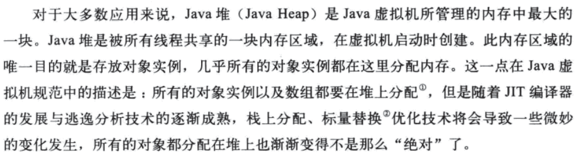
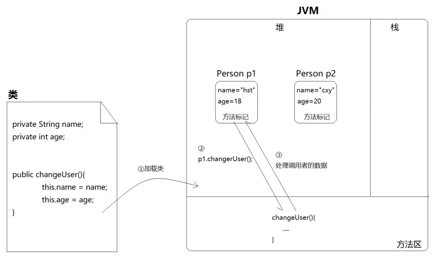
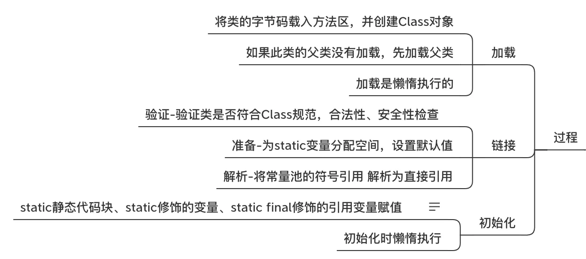

<p align="center">
   <a style="font-size:30px;"> this、super、static、final </a>
</p>

# 对象



我们暂且考虑在堆空间生成的对象，数据会在堆空间占据一定内存开销，而方法只有一份。

> 暂且认为 new 多个对象，属性会另外开辟堆空间存放，而方法不会。



**为什么方法被设计成只有一份呢？**

很多方法和对象的属性没有关联，没必要和属性数据一样单独在堆空间各存一份，可以抽取出来存放。

**当方法和属性有关联时，共性的方法如何处理特定的数据？**

this 能解决这个问题。

<br>

# this
this 通常是用来指当前对象。

**this 关键字大部分情况下可以省略，什么情况下不能省略呢？**

> 由于 java 规则的变量就近原则问题，在实例方法中，或者构造方法中，为了区分局部变量和实例变量，这种情况下 this 是不能省略的！

```java
class Student {

    String name;

    int age;

    public void setName(String name) {
        this.name = name;
    }

    public Student() {}

    public Student(String name) {
        this(); // 调用构造函数 public Student() {}，可以省略
        this.name = name;
    }

    public Student(String name, int age) {
        this(name);
        this.age = age;
    }

    public void test() {
        String name = "local name";
        System.out.println("local variable value is "+name+"name belongs to Object "+this.name);
    }

    public void print() {
        System.out.println(this);
    }

    @Override
    public String toString() {
        return "Name: " + name +"; Age: " + age;
    }
}

```

**不推荐使用 this 的情况：**

在不发生冲突的情况下成员属性或方法尽量不使用 this 。因为如果我们有一天需要将某个方法或成员变量改成 static，那就麻烦了，必须还要手动去掉 this。

# static

在 Java 学习中，我们一定还记得下面几个概念：

- 实例属性、类属性、实例方法、类方法；
- 在 Java 类中，可用 static 修饰属性、方法、代码块、内部类；
- static 修饰的属性或方法其实都是属于类的，是所有对象共享的；
- 被修饰后的成员具备以下特点：
    - 随着类的加载而加载；
    - 优先于对象存在；
    - 修饰的成员，被所有对象所共享；
    - 访问权限允许时，可不创建对象，直接被类调用。

我们以前总是在记静态属性、静态方法的特点。

**而关键是要明白，为什么一个变量或者方法要声明为 static？**

- static 变量：大家共有的，大家都一样，不是特定的差异化数据；
- static 方法：这个方法不处理差异化数据。

当类的所有对象都有某个相同的属性时，可以使用 static 修饰，定义为静态变量，这样在内存空间里只有一份。

当确定一个方法只提供通用的操作流程，而不会在内部引用具体对象的数据时，你就可以把它定为静态方法。


# super
类继承：


一个例题：
```java
public class FuTest {

    public static void main(String[] args) {
        // 猜猜打印的内容
        Zi zi = new Zi();
    }

    static class Fu {
        int a = 10;

        public void printA() {
            System.out.println("Fu PrintA:" + a);
        }

        public Fu() {
            printA();
        }
    }

    static class Zi extends Fu {
        int a = 20;

        @Override
        public void printA() {
            System.out.println("Zi PrintA:" + a);
        }

        public Zi() {
            printA();
        }
    }
}
```

```
Zi PrintA:0
Zi PrintA:20
```

## 字段的初始化时机

类加载阶段：




## 方法重写

虚方法表：

**为什么调用Fu构造器时，最终调用的是Zi的printA()，而不是Fu的printA()**

# final

final 的作用：
- final class，不允许 extends；
- final method，不允许 override；
- final field，不允许 change。 `final double MY_PI = 3.14;`

其实final本质上就做一件事：把任何动态的统统变成静态的，把不确定的变成确定的。以final method为例，当一个方法被final修饰，那么子类就不允许重写了，所以obj.method()调用时就是确定的。

## final 和 static 实践

# Reference