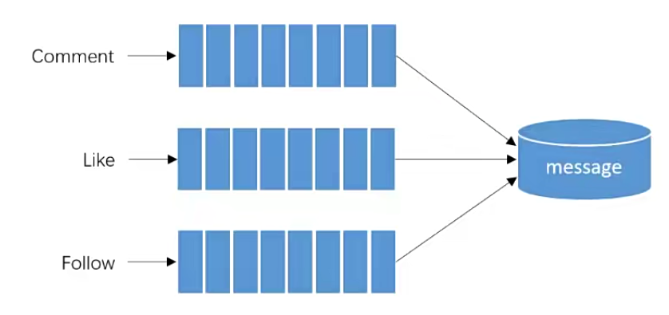

   <a style="font-size:30px;"> Kafka 用于论坛的系统通知 </a>

# 1 概述
开发时，基于事件为主体，从事件角度：
- 评论
- 点赞
- 关注

处理事件：
- 封装事件对象
- 开发事件的生产者
- 开发事件的消费者

触发事件时就调用生产者，消费者是自动触发的，只要队列有数据就自动触发了。

 

# 2 
## 2.1 

# Reference