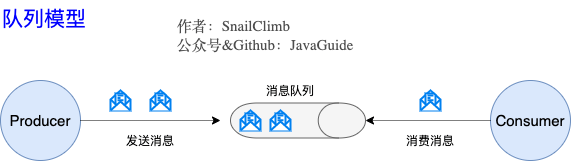

   <a style="font-size:30px;"> Kakfa 介绍 </a>

[JavaGuide-Kafka常见问题总结](https://javaguide.cn/high-performance/message-queue/kafka-questions-01.html)

# 1 Kafka: 一个分布式的流媒体平台
## 1.1 消息模型

1. 队列模型：早期的消息模型（点对点）

   

   使用队列（Queue）作为消息通信载体，满足生产者与消费者模式，一条消息只能被一个消费者使用，未被消费的消息在队列中保留直到被消费或超时。 比如：我们生产者发送 100 条消息的话，两个消费者来消费一般情况下两个消费者会按照消息发送的顺序各自消费一半（也就是你一个我一个的消费。）

2. 发布-订阅模型：Kafka 消息模型

   

   发布订阅模型（Pub-Sub） 使用主题（Topic） 作为消息通信载体，类似于广播模式；发布者发布一条消息，该消息通过主题传递给所有的订阅者，在一条消息广播之后才订阅的用户则是收不到该条消息的。
   
   **在发布 - 订阅模型中，如果只有一个订阅者，那它和队列模型就基本是一样的了。所以说，发布 - 订阅模型在功能层面上是可以兼容队列模型的。**

## 1.2 Kafka 基本概念
1. Producer（生产者） : 产生消息的一方。
2. Consumer（消费者） : 消费消息的一方。
3. Broker（代理） : Kafka 服务器，可以看作是一个独立的 Kafka 实例。多个 Kafka Broker 组成一个 Kafka Cluster。同时，你一定也注意到每个 Broker 中又包含了 Topic 以及 Partition 这两个重要的概念：
      
   - Topic（主题） : 发布订阅模式，产生者发布消息的位置即为 Topic，Producer 将消息发送到特定的主题，Consumer 通过订阅特定的 Topic(主题) 来消费消息。
      
   - Partition（分区） : Partition 属于 Topic 的一部分。一个 Topic 可以有多个 Partition ，并且同一 Topic 下的 Partition 可以分布在不同的 Broker 上，这也就表明一个 Topic 可以横跨多个 Broker 。这正如我上面所画的图一样。划重点：Kafka 中的 Partition（分区） 实际上可以对应成为消息队列中的队列。
  
4. Zookeeper ：一个独立的应用，用来管理集群。
   - [ZooKeeper相关概念总结(入门)](https://javaguide.cn/distributed-system/distributed-process-coordination/zookeeper/zookeeper-intro.html)
   - [ZooKeeper相关概念总结(进阶)](https://javaguide.cn/distributed-system/distributed-process-coordination/zookeeper/zookeeper-plus.html)

## 1.3 功能
1. 消息系统：发布和订阅消息流，这个功能类似于消息队列，这也是 Kafka 也被归类为消息队列的原因。
1. 容错的持久方式存储记录消息流：Kafka 会把消息持久化到磁盘，有效避免了消息丢失的风险。
2. 日志搜集、用户行为追踪
3. 流式处理平台： 在消息发布的时候进行处理，Kafka 提供了一个完整的流式处理类库。

## 1.4 应用场景  
1. 消息队列：建立实时流数据管道，以可靠地在系统或应用程序之间获取数据。
2. 数据处理： 构建实时的流数据处理程序来转换或处理数据流。

 

# 2 特点 
## 2.1 高吞吐量

## 2.1 消息持久化：存硬盘

## 2.3 高可靠性：分布式

## 2.4 高扩展性