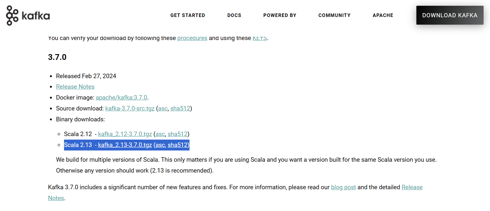
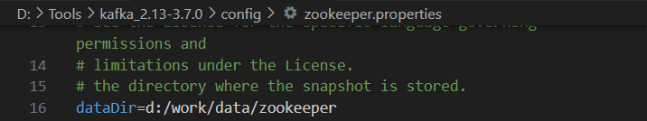
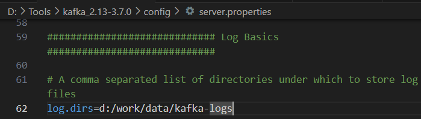
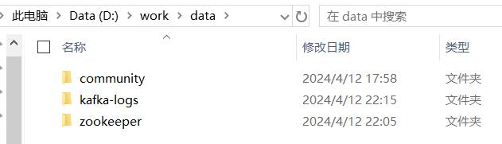
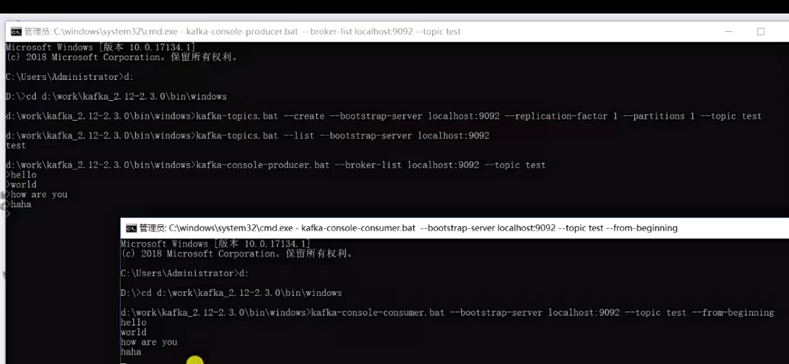
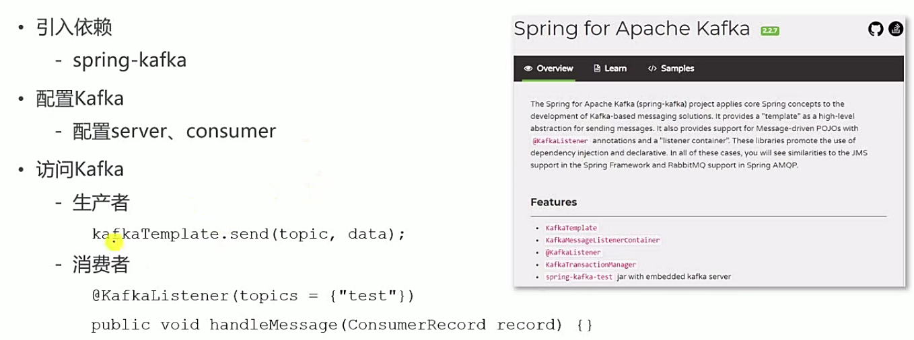
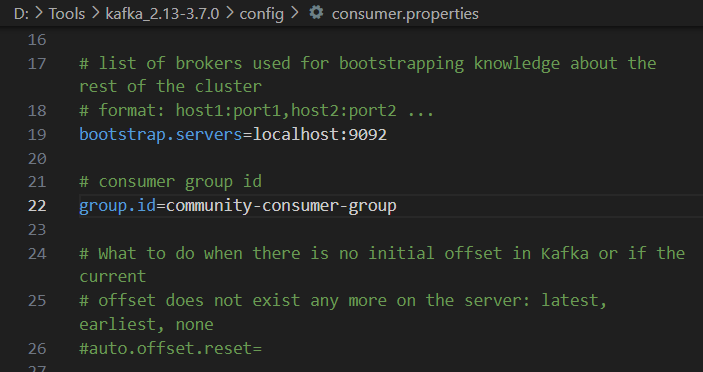

<p align="center">
   <a style="font-size:30px;"> Kafka 安装使用 </a>

</p>


# 下载

[Kafka](https://kafka.apache.org/)

下载最新推荐版本的二进制文件即可。



解压到合适目录，注意目录不要太深（运行会出现问题）。

# 配置

设置 zookeeper 快照和 Kafka 日志存放位置。

tips: 要保证 `d:\work\data` 目录已存在。






# Windows 系统下启动

进入安装目录，`/bin` 下 .sh 文件适用于 Linux 系统，Windows 下用 `/bin/windows` 下的文件。

启动 zookeeper:

```bash

D:\>cd Tools\kafka_2.13-3.7.0

D:\Tools\kafka_2.13-3.7.0> bin\windows\zookeeper-server-start.bat config\zookeeper.properties

```

另起命令行窗口，启动 Kafka:

```bash

D:\>cd Tools\kafka_2.13-3.7.0

D:\Tools\kafka_2.13-3.7.0>bin\windows\kafka-server-start.bat config\server.properties

```

生成对应文件：



# 使用




# Spring 整合 Kafka



依赖：
```
<dependency>
    <groupId>org.springframework.kafka</groupId>
    <artifactId>spring-kafka</artifactId>
</dependency>
```

配置：



保持一致，配置项目 application.properties 文件。
```java
# KafkaProperties
spring.kafka.bootstrap-servers=localhost:9092
spring.kafka.consumer.group-id=community-consumer-group
spring.kafka.consumer.enable-auto-commit=true
spring.kafka.consumer.auto-commit-interval=3000
```

Demo:

```java
@RunWith(SpringRunner.class)
@SpringBootTest
@ContextConfiguration(classes = CommunityApplication.class)
public class KafkaTests {

    @Autowired
    private KafkaProducer kafkaProducer;

    @Test
    public void testKafka() {
        kafkaProducer.sendMessage("test", "你好");
        kafkaProducer.sendMessage("test", "在吗");

        try {
            Thread.sleep(1000 * 10);
        } catch (InterruptedException e) {
            e.printStackTrace();
        }
    }

}

@Component
class KafkaProducer {

    @Autowired
    private KafkaTemplate kafkaTemplate;

    public void sendMessage(String topic, String content) {
        kafkaTemplate.send(topic, content);
    }

}

@Component
class KafkaConsumer {

    @KafkaListener(topics = {"test"})
    public void handleMessage(ConsumerRecord record) {
        System.out.println(record.value());
    }


}
```