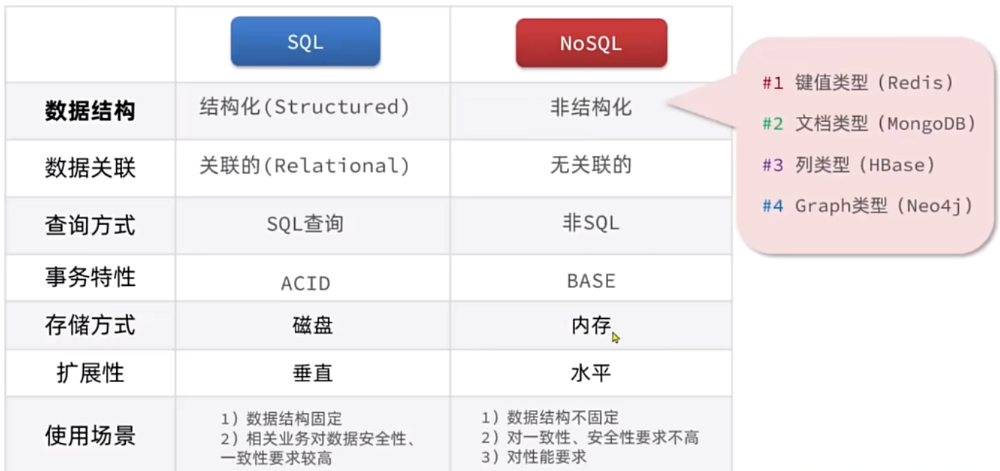
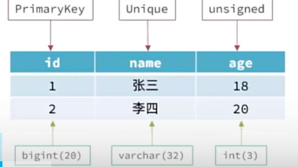
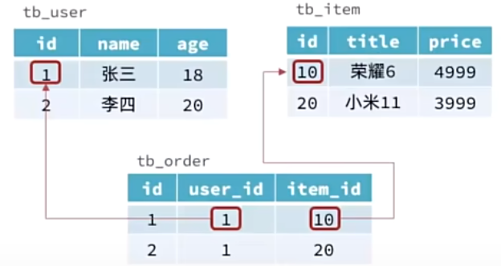

   <a style="font-size:30px;"> Redis </a>

# 1 缓存中间件 [Redis](https://redis.io/) 简介

Redis 基于 K-V 存储，是 NoSQL 数据库。

Value: String Hash List Set ZSset。

## 1.1 认识 NoSQL

SQL（Structured Query Language）
- 结构化
  
  

- 关联的（外键建立关系）

  

  
- SQL 查询

    只要是 SQL 数据库，同一套语法。

- ACID

    底层实现满足事务的原子性（Atomicity），一致性（Consistency），隔离性（Isolation），持久性（Durability）。

NoSQL

- 非结构化

    K-V, Document, Graph......

- 无关联的
  
    通过 JSON 文档记录关联，有重复性。

- 非 SQL

    Redis, MongoDB, elasticsearch 语法都不一样。

- BASE
  
    无法全部满足 ACID。

## 1.2 认识 Redis

 

# 2 Redis 命令

<https://redis.io/docs/latest/commands/>

## 2.1 

## 

# Reference