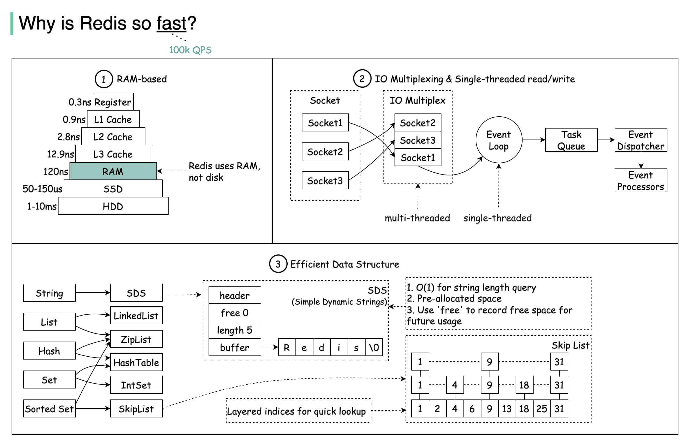

# 为什么快

1. Redis 基于内存，内存的访问速度比磁盘快很多；
2. Redis 基于 Reactor 模式设计开发了一套高效的事件处理模型，主要是单线程事件循环和 IO 多路复用（Redis 线程模式后面会详细介绍到）；
3. Redis 内置了多种优化过后的数据类型/结构实现，性能非常高。
4. Redis 通信协议实现简单且解析高效。

    

# Redis 线程模型

## Reactor 模式--高性能 IO 的基石