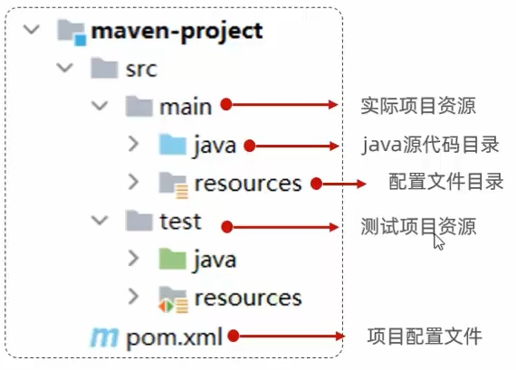
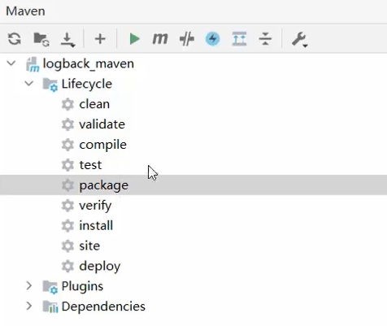

<p style="font-size:30px;">Maven</p>

<p style="font-size:20px;">目录</p>
<!-- TOC -->

- [1 Maven 简介](#1-maven-简介)
- [2 Maven 方便的依赖管理](#2-maven-方便的依赖管理)
    - [依赖管理和配置](#依赖管理和配置)
- [3 Maven 统一的项目结构](#3-maven-统一的项目结构)
- [4 Maven 标准的项目构建流程](#4-maven-标准的项目构建流程)

<!-- /TOC -->

# 1 Maven 简介
Java 项目需要第三方库（依赖），将依赖项信息编写到 Maven 工程的配置文件，软件自动下载复制依赖和依赖需要的依赖，并保证依赖版本无冲突、依赖完整。

项目开发完成后，快速构建项目和打包(mvn package)

```
Java EE（Java Enterprise Edition）和 Java SE（Java Standard Edition）是Java平台的两个不同的版本。

Java SE是Java平台的基础版本，提供了Java语言的核心功能和基本库。它包括了Java编程语言、Java虚拟机（JVM）、Java类库、Java开发工具等。Java SE被广泛应用于桌面应用程序、命令行工具、嵌入式系统等领域。

Java EE是构建企业级应用程序的Java平台扩展。它基于Java SE，并提供了一套丰富的API和工具，用于开发大规模、分布式、事务性的企业级应用。Java EE包括了 Servlet、JavaServer Pages（JSP）、Enterprise JavaBeans（EJB）、Java Persistence API（JPA）、Java Message Service（JMS）等技术。Java EE还提供了一些用于管理和部署应用程序的规范，例如Java Servlet 容器（如Tomcat、Jetty）和Java应用服务器（如JBoss、WebSphere）。

简而言之，Java SE是Java平台的基础版本，面向通用的应用开发，而Java EE是在Java SE基础上提供了专门用于企业级应用开发的扩展。如果你希望开发企业级应用程序，包括Web应用、分布式系统等，那么Java EE提供了更多的API和工具来支持这些需求。如果你只是开发简单的桌面应用程序或命令行工具，那么Java SE已经足够满足需求。
```


# 2 Maven 方便的依赖管理
    重点: 编写pom.xml文件<br>

## 依赖管理和配置
```
<!--可以统一声明依赖版本-->
<properties>
    <!--命名随便,内部制定版本号即可！-->
    <junit.version>4.11</junit.version>
    <jackson.version>2.15.2</jackson.version>
    <!-- 也可以通过 maven规定的固定的key，配置maven的参数！如下配置编码格式！-->
    <project.build.sourceEncoding>UTF-8</project.build.sourceEncoding>
    <project.reporting.outputEncoding>UTF-8</project.reporting.outputEncoding>
</properties>

<dependencies> <!--项目依赖信息的集合-->
    <dependency> <!--每一个依赖项-->
        <!--写入每个依赖项的[gav]属性 - 依赖的信息，依赖就是其他的maven工程[jar]-->
        <groupId>log4j</groupId>
        <artifactId>log4j</artifactId>
        <version>1.2.17</version>
        <version>${log4j.version}</version>    <!--若提前声明-->
        <!--scope属性是可选的，可以指定依赖生效范围！-->
    </dependency>

    <dependency> <!-- 每一个依赖项-->

    </dependency>
</dependencies>
```

依赖信息查询方式：<br>
    1. maven仓库信息官网 https://mvnrepository.com/<br>
    2. maven-search插件搜索<br>

# 3 Maven 统一的项目结构

不同 IDE 能构建标准、统一的项目结构。




# 4 Maven 标准的项目构建流程

提供跨平台 （Linux、Windows、MacOS）的自动化项目构建方式。

