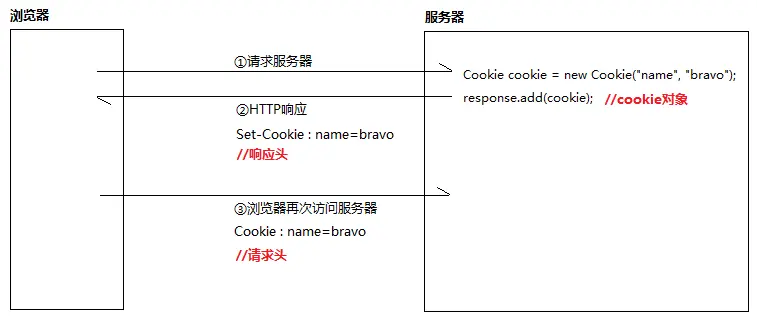
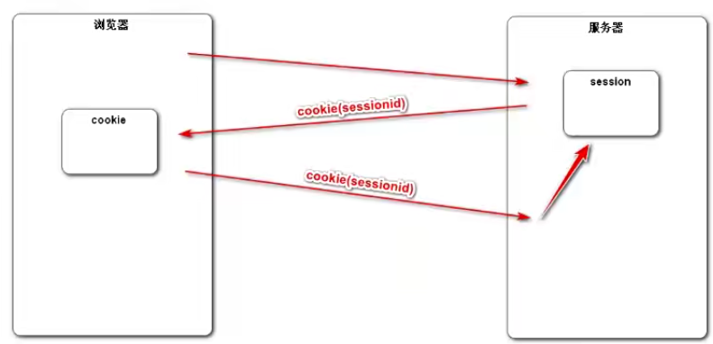
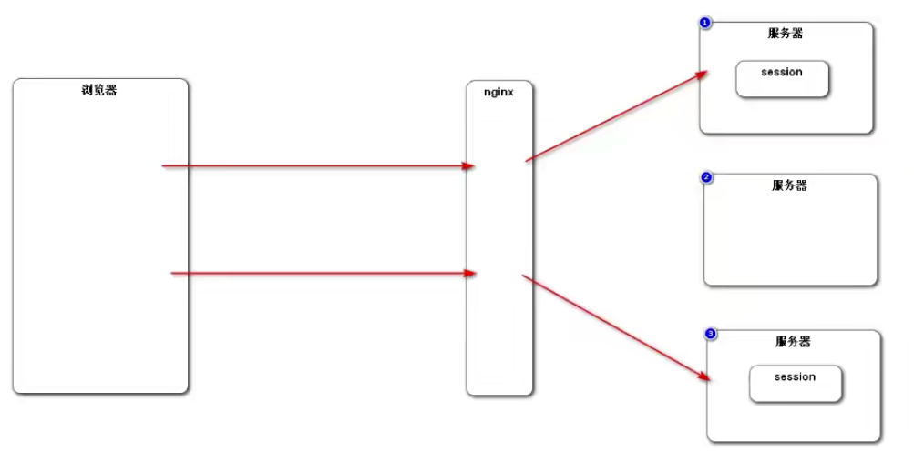
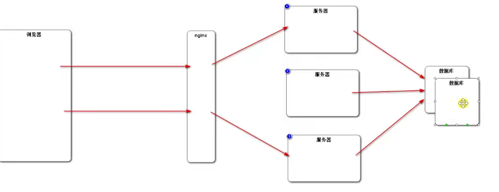

   <a style="font-size:30px;"> Cookie和Session </a>

为什么还有JWT

# 1 会话跟踪
从打开一个浏览器访问某个站点，到关闭这个浏览器的整个过程，称为一次会话。

会话机制最主要的目的是帮助服务器记住客户端状态（标识用户，跟踪状态）。目前，客户端与服务器的通讯都是通过HTTP协议。而HTTP是一种无状态协议。什么叫无状态？就是客户端第二次来访时，服务器根本不知道这个客户端以前是否来访过，Web服务器本身不能识别出哪些请求是同一个浏览器发出的。即：浏览器的每一次请求都是完全孤立的。

在Java的世界里，会话跟踪常用的有两种技术：Cookie和Session，并且Session底层依赖于Cookie。

 

# 2 认识Cookie
## 初识

从编程的角度来讲，Cookie其实是一份小数据，是服务器响应给客户端，并且存储在客户端的一份小数据。下次客户端访问服务器时，会自动带上这个Cookie。服务器通过Cookie就可以区分客户端。

简单实现：

- 服务器端new一个Cookie，通过response的addCookie方法响应给浏览器。
- 给浏览器发送 HTTP 响应前，cookie 会标识在 HTML响应头中。也就是Set-Cookie响应头。
- 浏览器接收到这些响应头后，会把它们作为Cookie文件存在客户端。当我们第二次请求同一个服务器，浏览器在发送HTTP请求时，会带上这些Cookie。
    

## Cookie 的两种类型

其实Cookie可以分为两种：

- 会话Cookie (Session Cookie)
- 持久性Cookie (Persistent Cookie)

会话Cookie被保存在浏览器的内存中，当浏览器关闭时，内存被释放，内存中的Cookie自然也就烟消云散。

这样太麻烦了，关闭浏览器引发Cookie消失，下次还要重新登录。能不能向客户端响应持久性Cookie呢？只要设置Cookie的持久化时间即可！

# 认识Session

##

JavaEE 标准，用于服务端记录客户端信息。更安全，但增加服务端内存压力。

相比较Cookie存在客户端，Session则是服务端的东西。其本质上类似于一个大Map，里面的内容，以键值对的形式存储。

这回，我们不再把"name=brava1988;time=6pm;table=69"这样的数据作为Cookie放在请求头/响应头里传来传去了，而是只给客户端传一个JSESSIONID（其实也是一个Cookie）！此时，真正的数据存在服务器端的Session中，Cookie中只是存了Session的id，即JSESSIONID。下次访问该网站时，把JSESSIONID带上，即可在服务器端找到对应的Session，也相当于“带去”了用户信息。

  

## Session 序列化

## Session 钝化和活化

## 分布式部署时 Session 的问题

当不同请求在不同服务器处理，新服务器中找不到前面的 SessionID 对应的 Session。
    

解决：
1. 粘性 Session，相同 SessionID 分给同一个服务器处理。

    不能保证负载均衡。

2. 同步 Session，某个服务器创建 Session 后同步给其他服务器。

    降低服务器集群性能，造成服务器耦合。

3. 共享 Session，单独一台服务器统一处理 Session。

    一台服务器造成瓶颈。

4. 先考虑用 Cookie，敏感数据存数据库，数据库（Redis）做集群
   
   

# Reference