<!-- TOC -->

- [1 前后端分离开发](#1-前后端分离开发)
    - [1.1 接口文档](#11-接口文档)
    - [1.2 接口文档管理平台 YApi](#12-接口文档管理平台-yapi)
- [2 前端工程](#2-前端工程)
    - [2.2 Vue 脚手架](#22-vue-脚手架)
        - [2.2.1 Vue 的依赖环境 NodeJS](#221-vue-的依赖环境-nodejs)
        - [2.2.2 Vue 项目构建](#222-vue-项目构建)
    - [2.3 前端工程打包部署](#23-前端工程打包部署)
        - [2.3.1 前端服务器 Nginx 介绍](#231-前端服务器-nginx-介绍)
        - [2.3.2 打包部署](#232-打包部署)
- [3 后端工程](#3-后端工程)
    - [3.1 Java 项目构建工具：Maven](#31-java-项目构建工具maven)
    - [3.2 SpringBoot Web](#32-springboot-web)
    - [3.3 MySQL](#33-mysql)
    - [3.4 SpringBoot MyBaits](#34-springboot-mybaits)
    - [3.5 后端项目部署](#35-后端项目部署)
        - [3.5.1 Tomcat 使用](#351-tomcat-使用)

<!-- /TOC -->

# 1 前后端分离开发
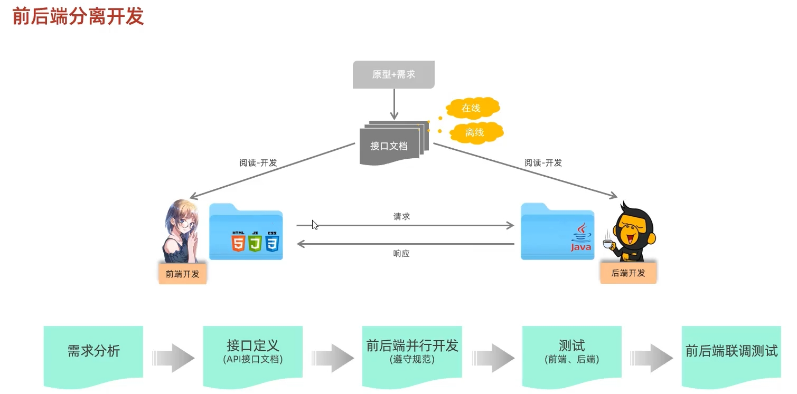
## 1.1 接口文档

## 1.2 接口文档管理平台 YApi
1. API 接口管理
2. Mock 服务：用于前端测试

<https://yapi.pro/>

<https://yapi.pro/group/227616>

使用：
1. 添加项目
2. 添加分类
3. 添加接口

# 2 前端工程
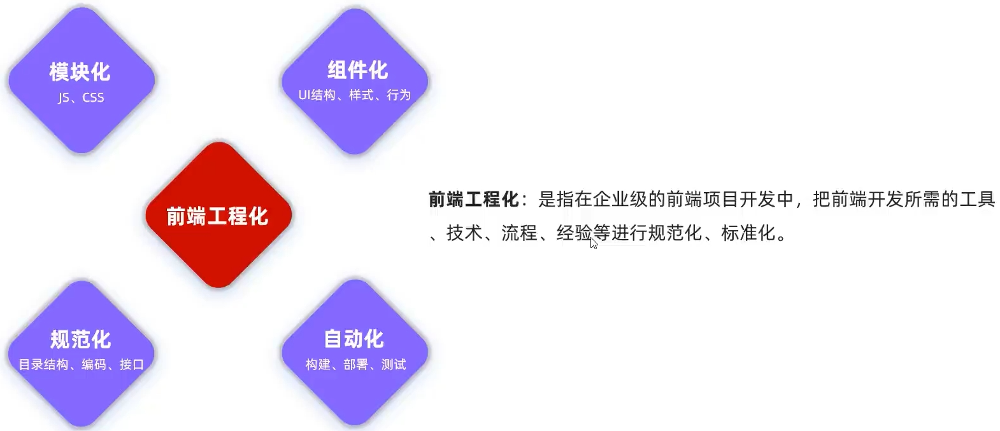

使用工具：Vue。

## 2.2 Vue 脚手架
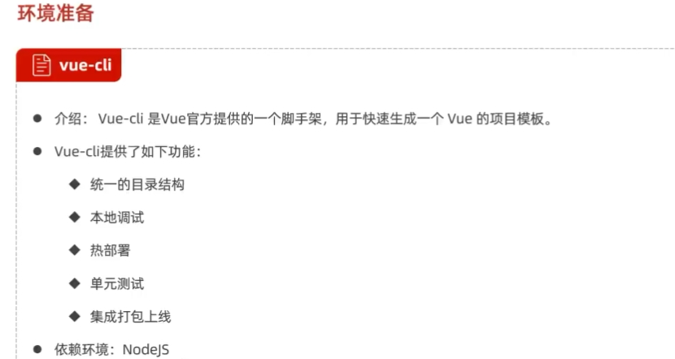

### 2.2.1 Vue 的依赖环境 NodeJS 
查看安装文档。

### 2.2.2 Vue 项目构建
项目构建：查看文档。

Vue 项目文件结构：

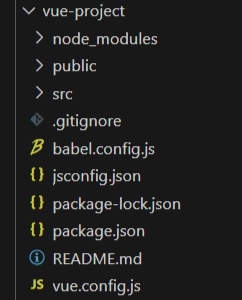

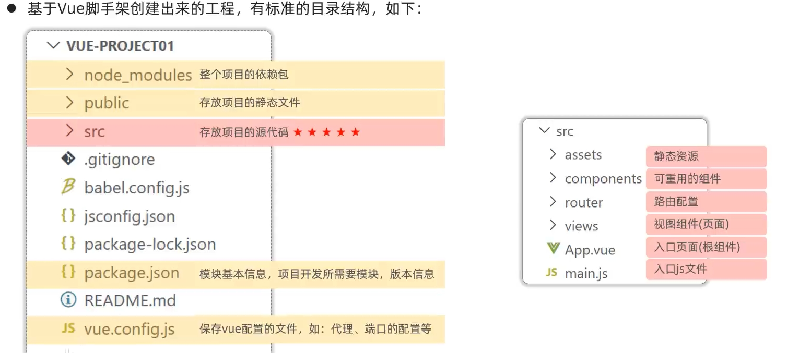

Vue 项目启动：

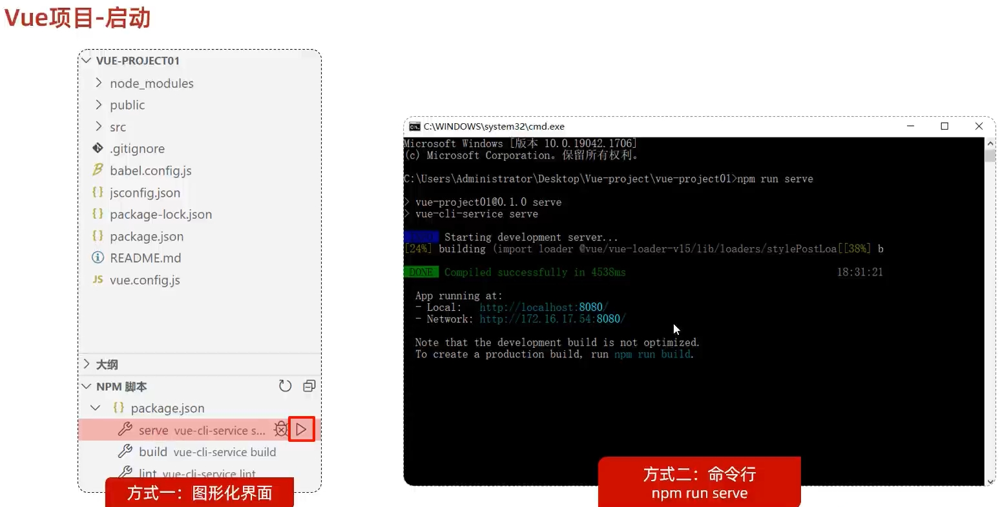

VSCODE 侧栏打开 NPM 脚本 <https://blog.csdn.net/tcr931117355/article/details/115718746>

Vue 项目端口配置：

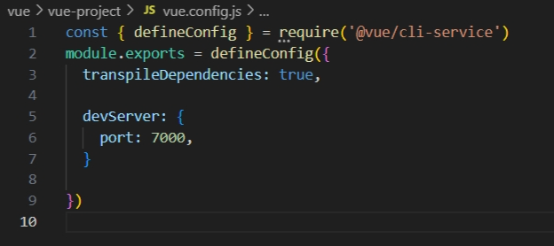

开发流程：

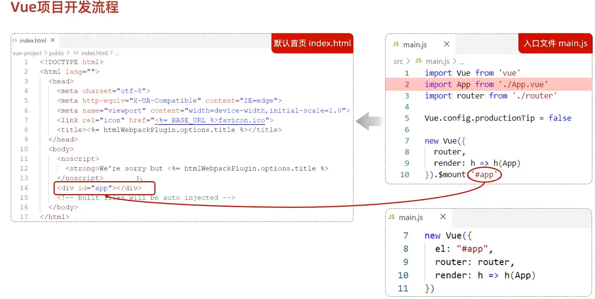

~~~~
new Vue({
  router,
  render: h => h(App)
}).$mount('#app')
~~~~
通过 render 创建虚拟 DOM 元素，在 APP.vue 中。

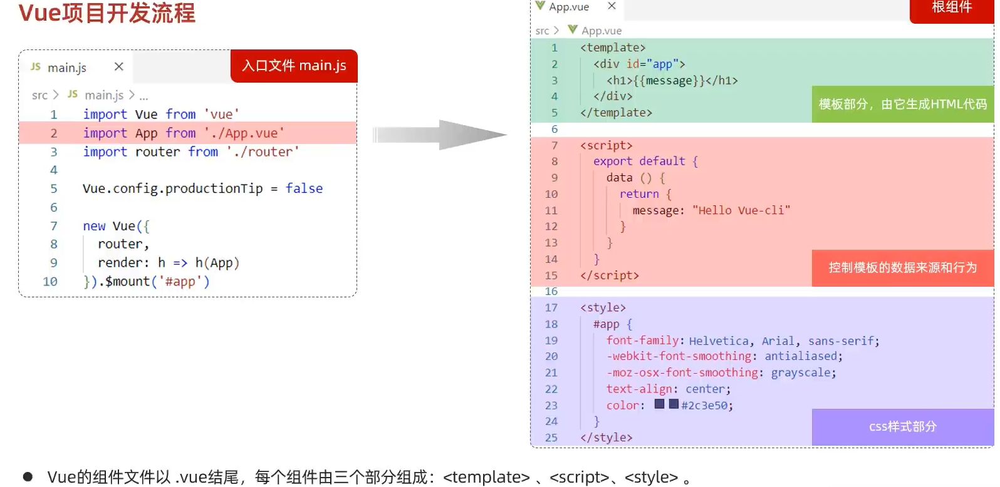

## 2.3 前端工程打包部署
前后端分离项目，前后端工程部署到不同的服务器上。
### 2.3.1 前端服务器 Nginx 介绍
Nginx: Nginx 是一款轻量级的 Web 服务器/反向代理服务器及电子邮件（IMAP/POP3）代理服务器。其特点是占有内存少，并发能力强，在各大型互联网公司都有非常广泛的使用。

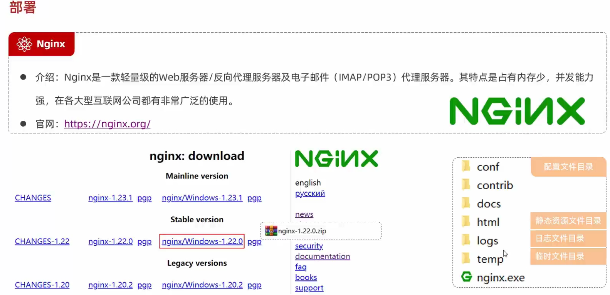

### 2.3.2 打包部署
执行 NMP 脚本的 build 完成项目打包。

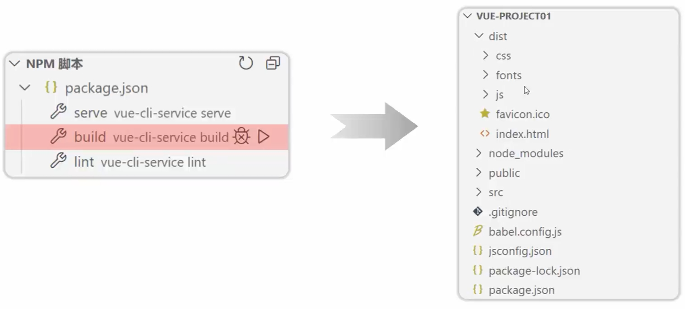

**很明显，我们如果要发布，直接将资源放入到html目录中。**

将我们之前打包的前端工程 dist 目录下得内容拷贝到 nginx 的 html 目录下。
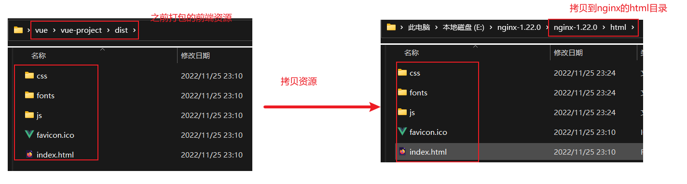

然后我们通过双击 nginx 下的 nginx.exe 文件来启动 nginx。
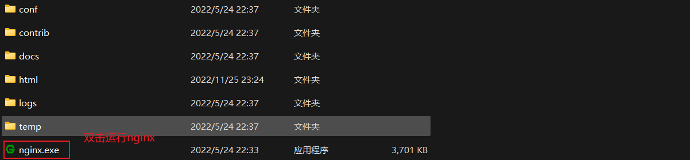

nginx 服务器的端口号是 80，所以启动成功之后，我们浏览器直接访问 http://localhost:80 即可，其中 80 端口可以省略。

到此，我们的前端工程发布成功。

PS: 如果80端口被占用，我们需要通过 **conf/nginx.conf** 配置文件来修改端口号。
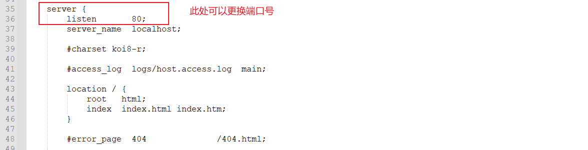

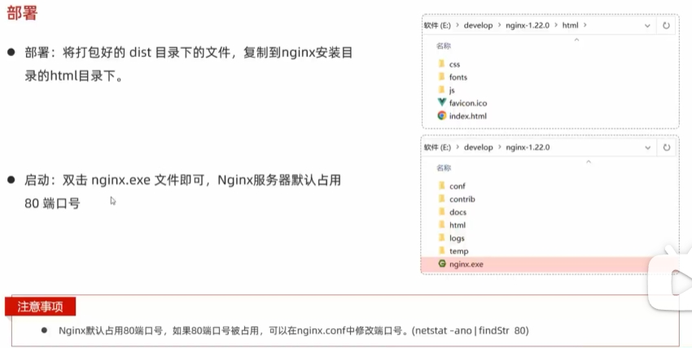

**反向代理服务器，负载均衡**

# 3 后端工程
## 3.1 Java 项目构建工具：Maven

## 3.2 SpringBoot Web

Spring 官方骨架：<https://start.spring.io/>

由此创建 Spring 项目模板：

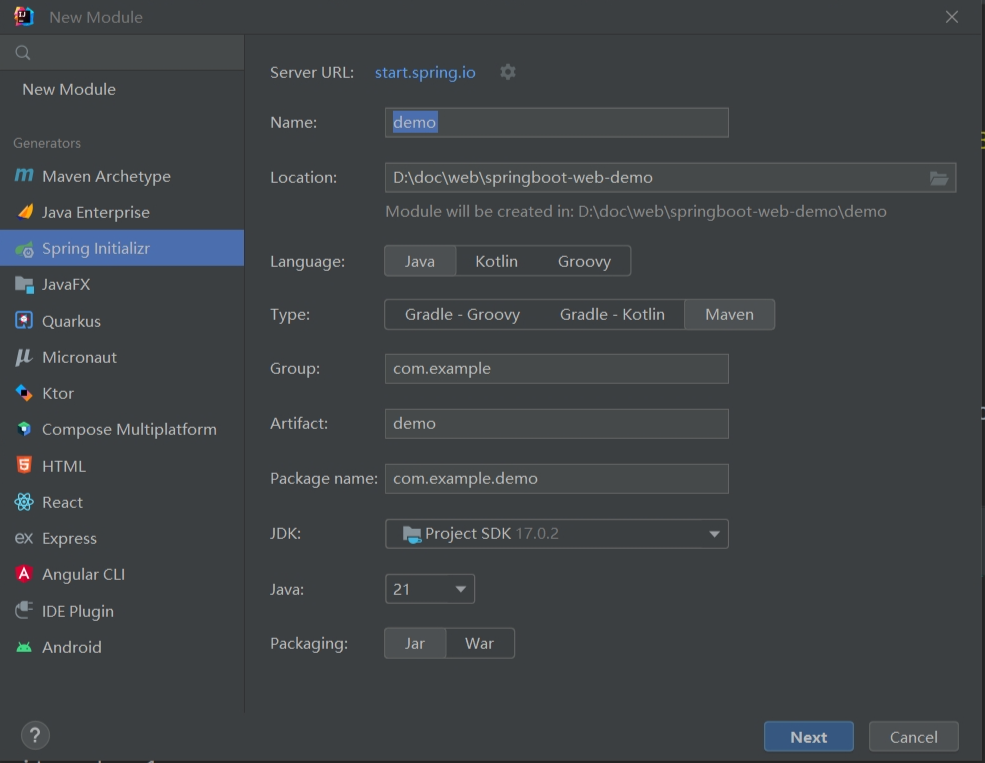

或在官网创建 Spring 项目模板文件压缩包，解压即可用：

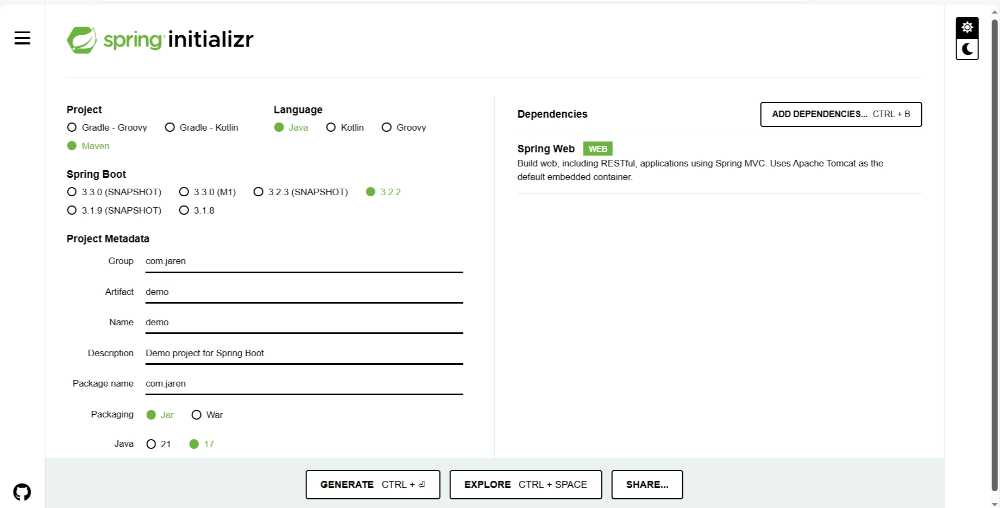

## 3.3 MySQL

## 3.4 SpringBoot MyBaits

## 3.5 后端项目部署

Web 服务器 Apache Tomcat。

- 封装 http 协议的操作，使得 web 开发更加便捷。
- 部署 web 项目，对外提供网上信息浏览服务。

### 3.5.1 Tomcat 使用

绿色安装，解压文件就行。

启动：bin/startup.bat；正常关闭：Ctrl+C，shutdown.bat。

配置文件：conf。端口号：conf/server.xml; 窗口字符编码：conf/logging.properties。

项目部署：web 应用放在 webapps 目录下。