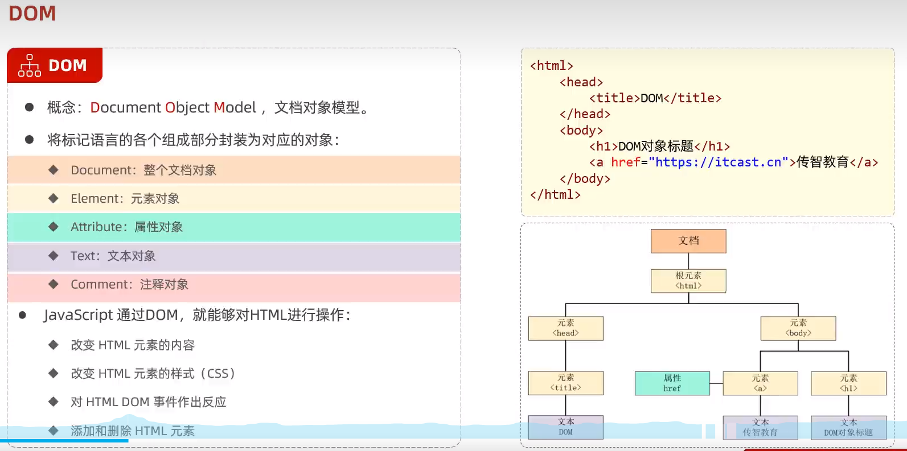

JavaScript HTML DOM

# DOM (Document Object Model)
DOM 是一项 W3C (World Wide Web Consortium) 标准，定义了访问文档的标准：

“W3C 文档对象模型（DOM）是中立于平台和语言的接口，它允许程序和脚本动态地访问、更新文档的内容、结构和样式。”

W3C DOM 标准被分为 3 个不同的部分：

- Core DOM - 所有文档类型的标准模型
- XML DOM - XML 文档的标准模型
- HTML DOM - HTML 文档的标准模型D

# HTML DOM
HTML DOM 是关于如何获取、更改、添加或删除 HTML 元素的标准。

将标记语言的各个组成部分按文档对象模型 DOM（Document Object Model）封装为对应的对象。当网页被加载时，浏览器会创建页面的文档对象模型，通过这个对象模型，JavaScript 能够创建动态 HTML。

1. 获取到要操作的元素对象。

2. 通过元素对象的属性、方法完成控制。
