# HTML 快速入门
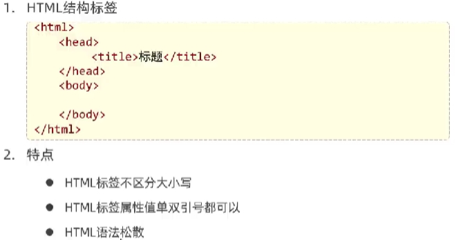

# HTML 基础标签、样式   

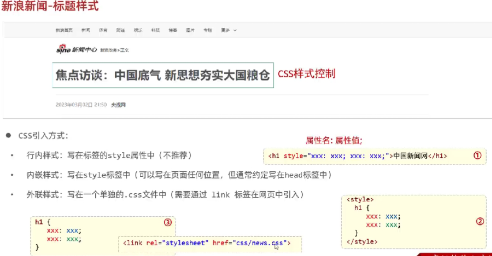

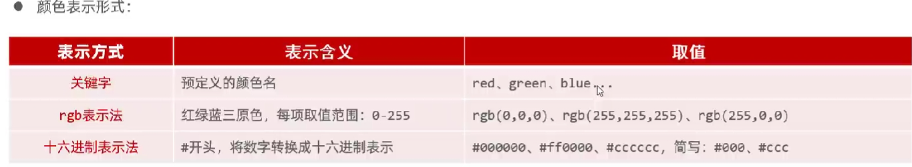

# CSS 选择器
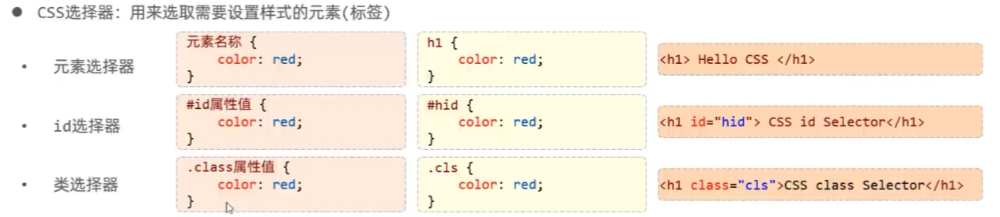

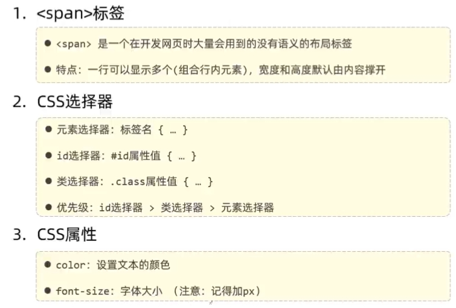

# 超链接
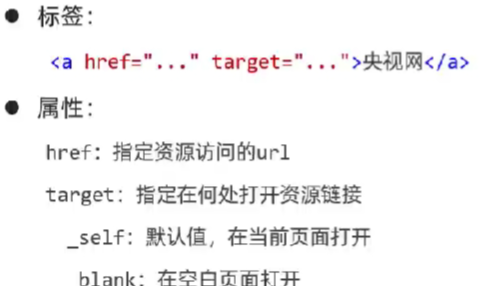

# 正文
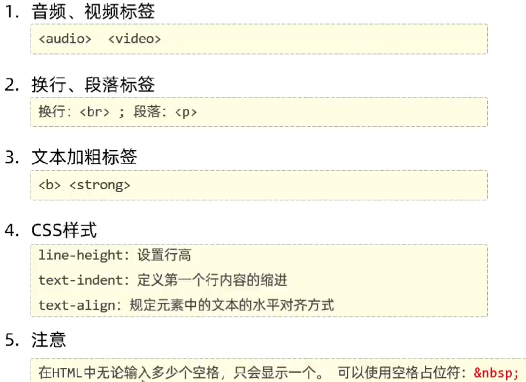

# 页面布局
## 盒子模型
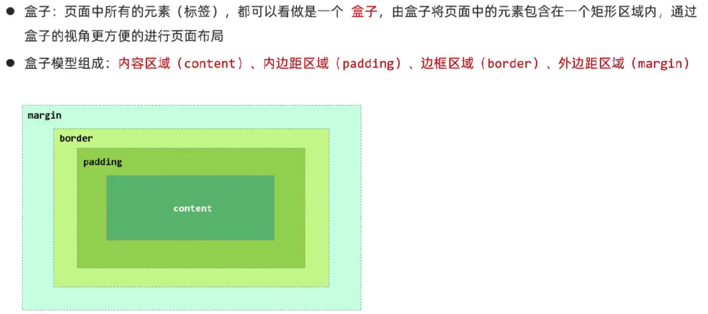

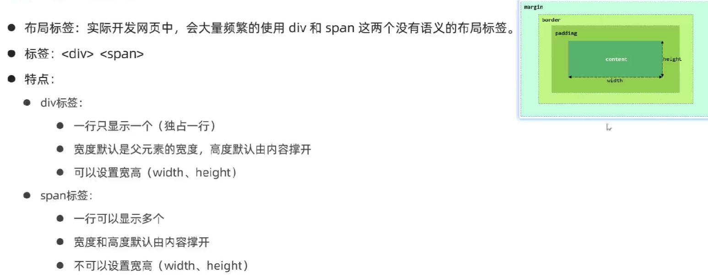

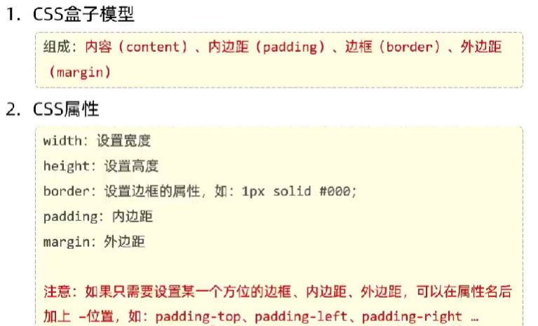

# 表格标签
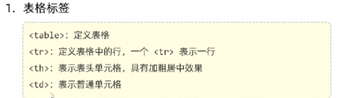
# 表单标签
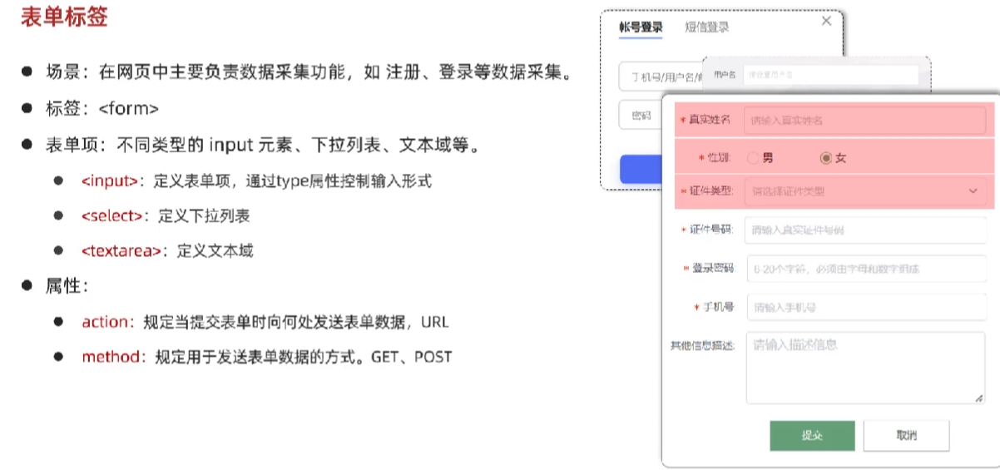

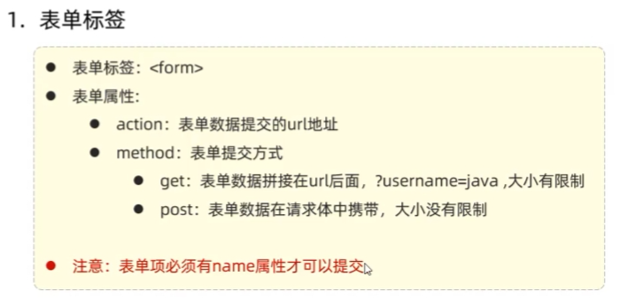

## 表单项标签
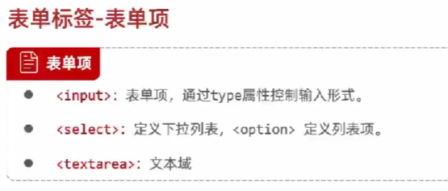

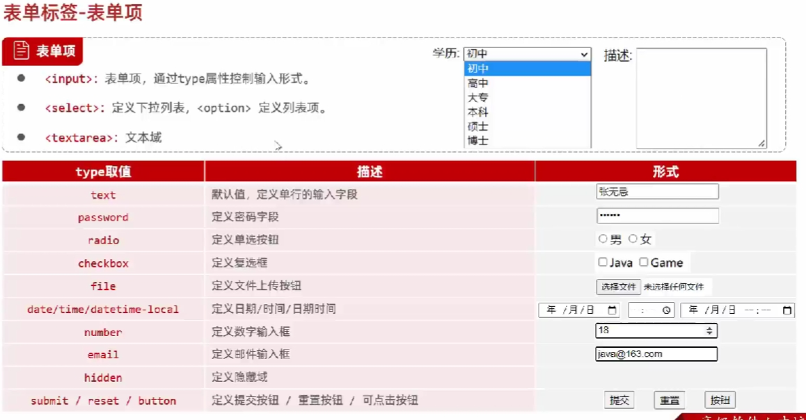

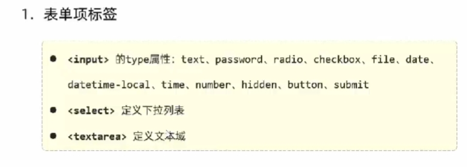

# JS
## js 引入方式（和html结合
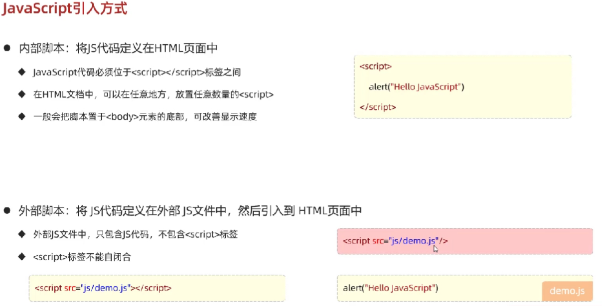

## js 基础语法
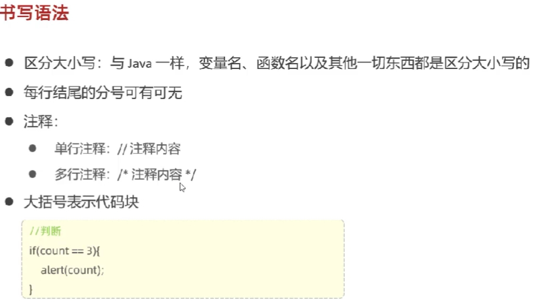

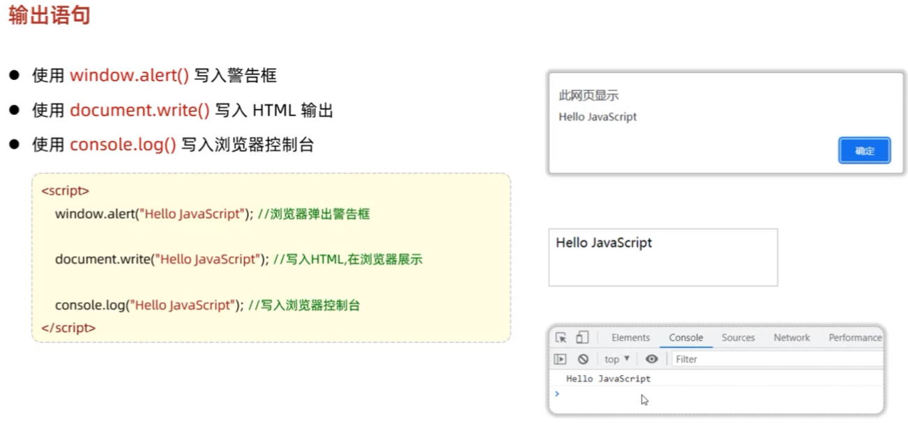

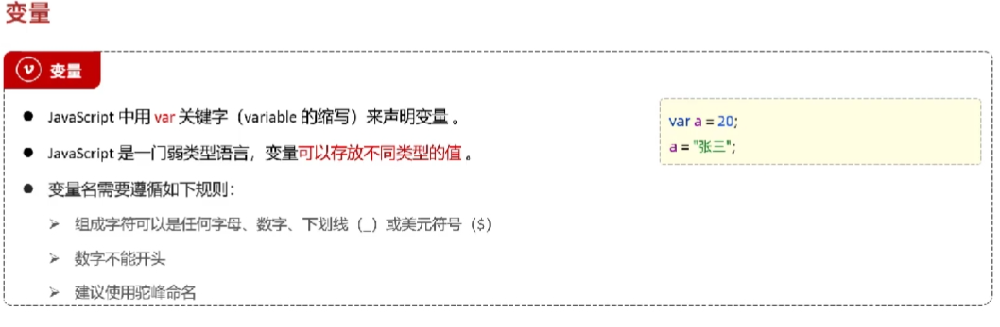

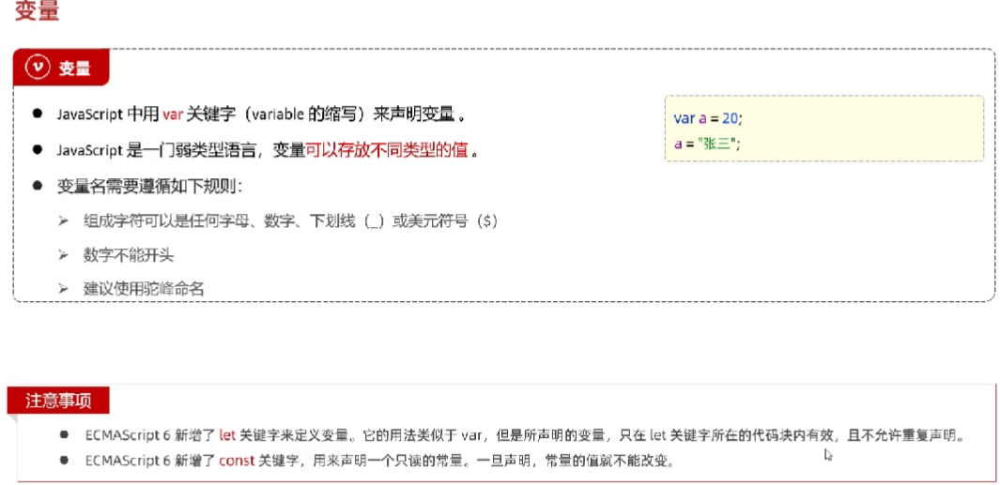

数据类型

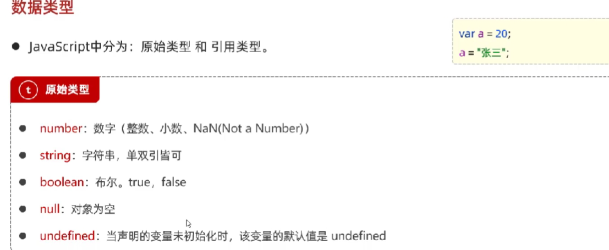

运算符

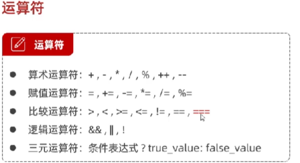

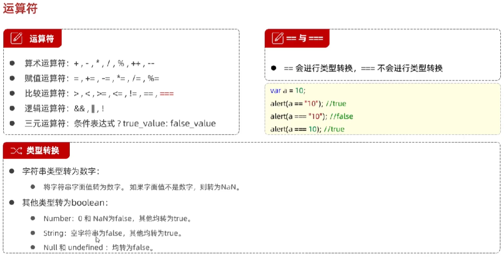
## js 函数

## js 对象

## js 事件监听