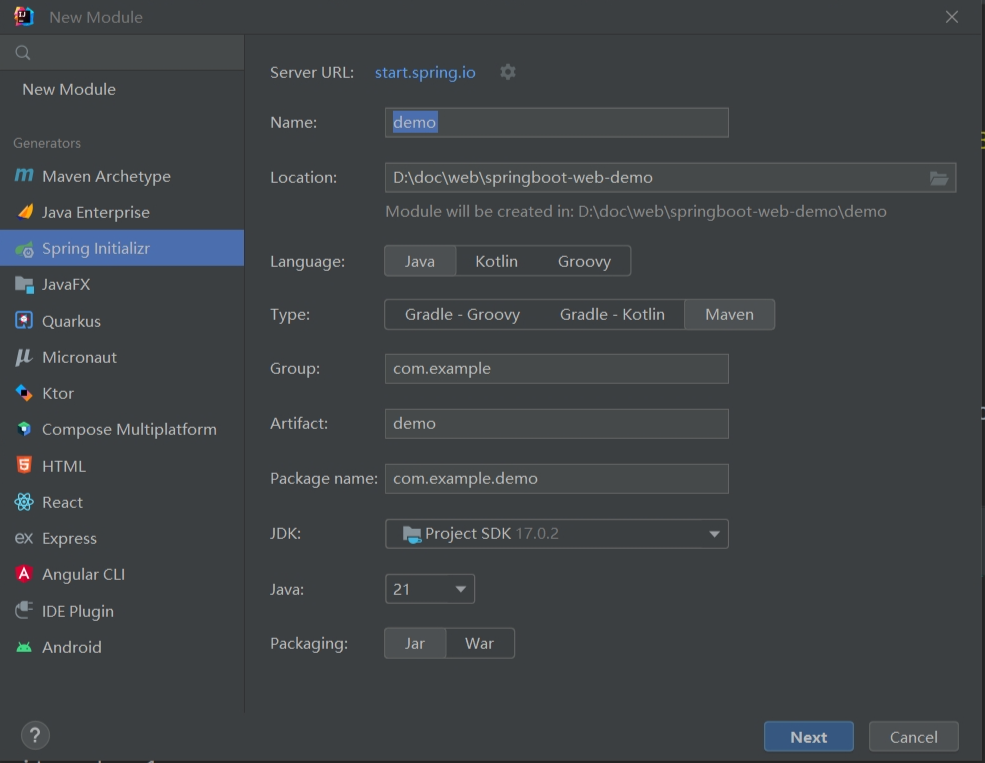
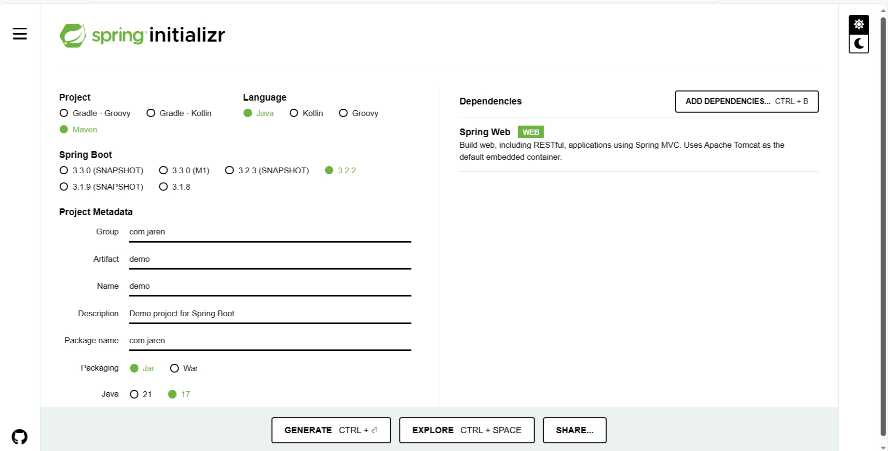

Web 服务器 Apache Tomcat。

- 封装 http 协议的操作，使得 web 开发更加便捷。
- 部署 web 项目，对外提供网上信息浏览服务。

# Tomcat 使用

绿色安装，解压文件就行。

启动：bin/startup.bat；正常关闭：Ctrl+C，shutdown.bat。

配置文件：conf。端口号：conf/server.xml; 窗口字符编码：conf/logging.properties。

项目部署：web 应用放在 webapps 目录下。

# Tomcat 入门程序解析

Spring 官方骨架：<https://start.spring.io/>

由此创建 Spring 项目模板：

或在官网创建 Spring 项目模板文件压缩包，解压即可用：

