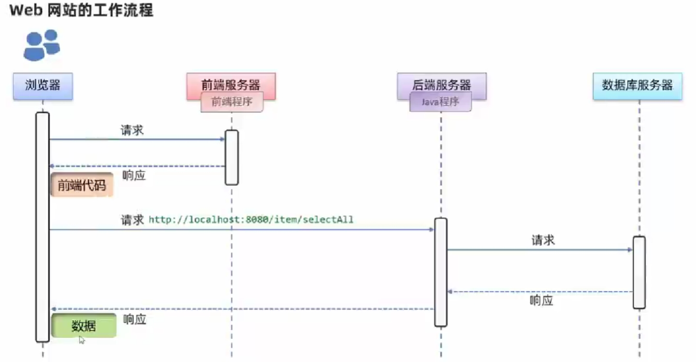
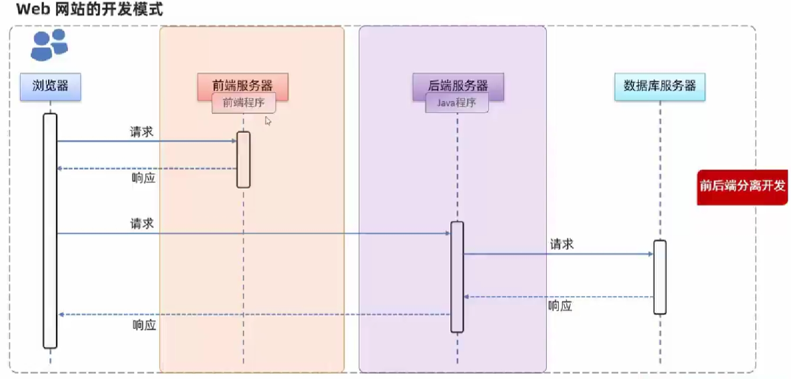
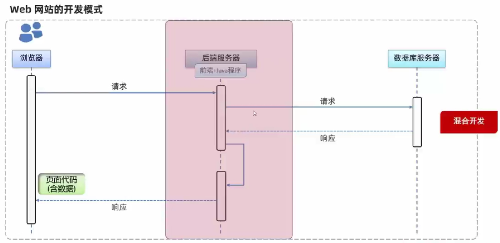
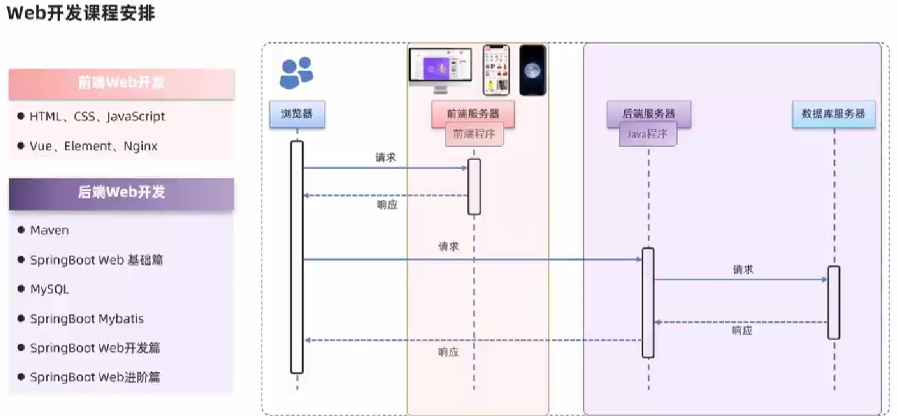
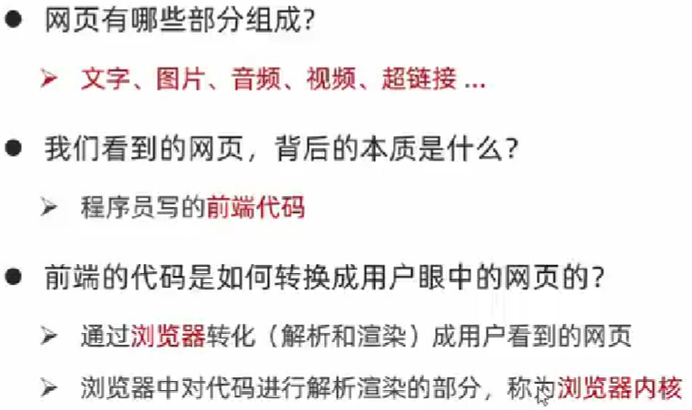
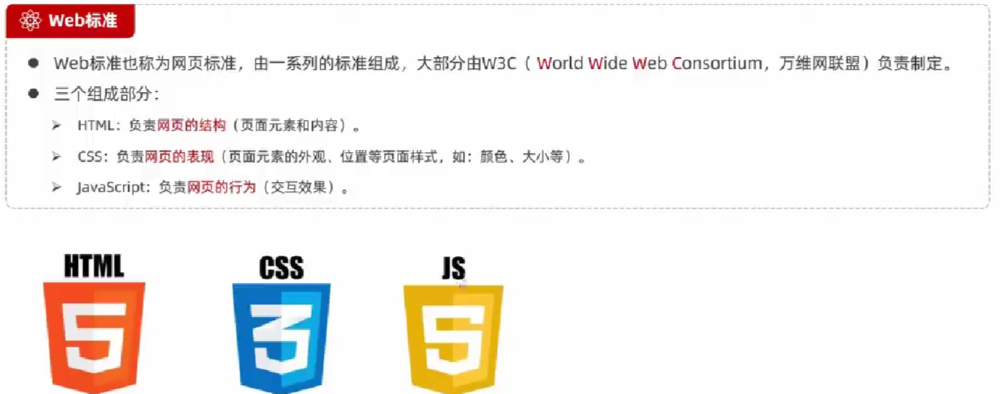

# JavaWeb的内容大致包括：

Tomcat（Tomcat外传）

Servlet、JSP（浅谈JSP）

Session、Cookie（Cookie与Session）

JDBC

Filter/Listener

AJAX、JSON（AJAX与JSON）

# 文档
https://www.w3school.com.cn/

# Web
World Wide Web (WWW or simply the Web) 

Web 网站整体工作流程

# 初识 Web 前端

# HTML
HTML (HyperText Markup Language): 超文本标记语言
