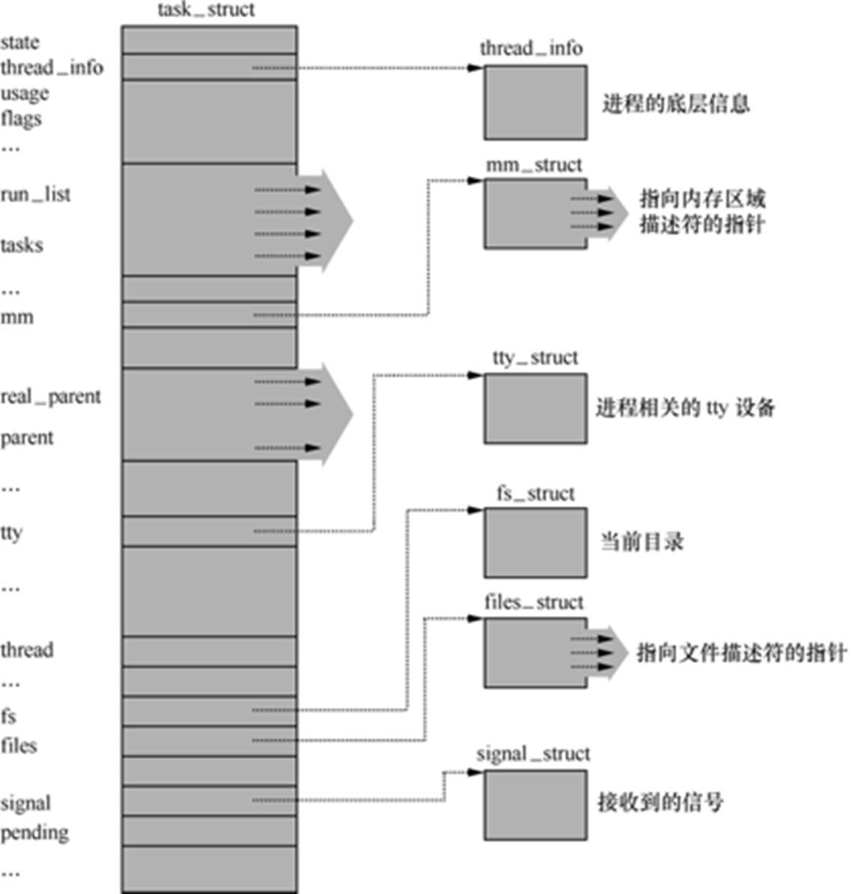

<p align="center">
   <a style="font-size:30px;"> 在Linux系统中程序是如何执行的？ </a>

</p>

在现代计算机系统中，操作系统扮演着至关重要的角色，而Linux系统作为一种流行的开源操作系统，具有悠久的历史、稳定的接口方式、符合程序员思维方式，更是在服务器开发和嵌入式开发领域应用广泛。在Linux环境下做开发可以彻底掌控设计，大多为开源工具和框架，可以跟踪了解完整的技术栈。本文将详细探讨在Linux系统中，程序从编写到执行的整个过程，包括进程的创建、可执行程序的加载、程序的执行和进程的调度等方面。

# 1 进程的描述和创建
我们将操作系统上正在运行的程序称之为进程。

如何管理这些进程呢？—— 先描述，再组织。

## Linux 操作系统的进程描述
在操作系统原理中，我们通过进程控制块（PCB, Processing Control Block）描述进程，在 Linux 中，进程控制块就是 struct task_struct 结构体。



操作系统通过对组织好的PCB进行管理，进而完成对进程的管理。

## 进程创建的系统调用
在Linux系统中，进程创建是通过一系列精心设计的系统调用和内核函数协同工作完成的。这个过程不仅涉及到用户态和内核态之间的切换，还包括对进程资源的复制和管理。主要涉及的系统调用有`fork()`, `vfork()`, 和`clone()`。

- `fork()`创建一个与父进程几乎完全相同的子进程，包括内存页等资源的复制。
- `vfork()`与`fork()`类似，但是它不复制父进程的页表，子进程与父进程共享地址空间，直到子进程调用`exec()`或`_exit()`。`vfork()`主要用于创建一个新进程来执行新的程序。
- `clone()`允许子进程与父进程共享文件描述符、信号处理函数等资源。`clone()`可以用来创建线程。

在用户态创建进程时，程序会执行一个系统调用，如`fork()`系统调用，这是进程创建的基础，它的执行过程对于父进程来说，与其他系统调用类似，但对于子进程，当`fork()`被调用时，子进程几乎复制了父进程的全部状态，包括内核堆栈、进程描述符等。该系统调用会触发一个中断，从而将执行上下文从用户态切换到内核态。在内核态，操作系统内核会接管，执行必要的服务，然后返回用户态。

- **子进程的执行入口：`ret_from_fork()`**
  
  在Linux内核中，子进程的执行并不是从`fork()`系统调用之后的下一条指令开始的，而是从一个特殊的入口点开始，在x86架构中，这个入口点是`ret_from_fork()`函数。这个函数是在子进程的内核堆栈上设置的，以便在子进程第一次获得CPU时，它能够从这个函数开始执行。`ret_from_fork()`函数负责初始化子进程的执行环境，并将控制权交给子进程的用户态代码。

- **内核处理：`_do_fork()`**
  
  在创建子进程的过程中，`_do_fork()`函数负责调用`copy_process()`来复制父进程的`task_struct`，并进行必要的调整。这包括分配一个新的PID、设置子进程的状态以及初始化新的内核堆栈。
  
  `copy_process()`会创建一个几乎完全相同的进程描述符，但是会修改一些关键的字段，如PID和某些资源的指针。接着，`copy_thread_tls()`函数会被调用，它设置子进程的线程局部存储（TLS）和寄存器状态，包括指令指针（IP）和栈指针（SP）。这里的指令指针会被设置为`ret_from_fork()`。
  
  `fork()`、`vfork()`和`clone()`系统调用的实现都会调用`_do_fork()`函数，传递的参数不同。`vfork()`会传递参数以确保父子进程共享地址空间，而`clone()`则可以传递更多的标志来控制资源的共享程度。
  
  一个简化的`_do_fork()`函数调用的例子：
  
```c
long _do_fork(struct kernel_clone_args *args)
{
    struct task_struct *p;
    p = copy_process(args); // 复制父进程的task_struct
    if (IS_ERR(p))
        return PTR_ERR(p);

    copy_thread_tls(p, args); // 设置子进程的TLS和寄存器状态
        // 其他设置和错误处理的代码

    wake_up_new_task(p); // 将新进程加入调度队列

    return p->pid; // 返回新进程的PID
}
```

# 2 程序的加载

了解了Linux系统中进程的描述和创建之后，自然会想到我们编写的可执行程序是如何作为一个进程工作的?这就包括可执行文件的格式、编译、链接和装载等相关知识。

## ELF 目标文件格式
“目标文件”是指编译器生成的文件。“目标”指目标平台， 例如x86或 x86-64，它决定了编译器使用的机器指令集。ELF(Executable and Linkable Format)即可执行的和可链接的文件格式标准。

ELF文件结构：

- ELF头：描述文件的整体结构。
- 节区：每个节区包含代码、数据或其他类型的信息。
- 程序头表：描述加载到内存中的各段。


## 程序的编译
程序从源代码到可执行文件的编译步骤大致分为：预处理、编译、汇编、链接。以下示例继续使用hello.c，4步分别对应的指令如下。

```bash
# 预处理
gcc -E hello.c -o hello.i
# 编译
gcc -S hello.i -o hello.s
# 汇编
gcc -c hello.s -o hello.o
# 链接，-static为静态链接
gcc hello.o -o hello -static

```
汇编后形成的.o格式的文件已经是ELF格式文件了,包含多个节区（Section），如 .text、.data 和 .bss：

- .text段：存放程序的执行代码。这部分区域在程序运行前已确定，通常是只读的。
- .data段：存放已初始化的全局变量。
- .bss段：存放未初始化的全局变量。该段在程序运行时由系统初始化为0。

## 静态链接
在编译链接时直接将需要的执行代码复制到最终可执行文件中，优点是代码的装载速度快，执行速度也比较快，对外部环境依赖度低。编译时它会把需要的所有代码都链接进去，应用程序相对比较大。缺点是如果多个应用程序使用同一库函数，会被装载多次，浪费内存。
```bash
$ gcc hello.o -o hello -static
```
## 动态链接
动态链接分为可执行程序装载时动态链接和运行时动态链接。

**装载时动态链接**
发生在程序启动阶段，当可执行文件被操作系统装载（加载）到内存中执行时。动态链接器（如Linux中的ld.so）会解析程序中对动态库（如.so文件）的依赖，找到这些库文件，将它们也加载到内存中，并将程序中的符号引用与库中的符号定义进行绑定。

装载时动态链接的关键过程包括：

- **解析共享库依赖**：动态链接器读取可执行文件的动态段，确定程序需要哪些共享库。
-  **加载共享库**：动态链接器将这些共享库加载到内存中。
-  **符号解析和重定位**：对于程序中的每个外部符号（如函数或变量的引用），动态链接器在加载的共享库中查找这些符号的地址，并更新程序中的引用，使其指向正确的内存地址。

在C语言中，使用动态库的函数时，装载时动态链接的过程对开发者是透明的。

```c
#include <stdio.h>

int main() {
    printf("Hello, World!\n");
    return 0;
}
```

例如`printf`函数来自C标准库，在程序启动时，动态链接器会自动处理这种依赖关系。

**运行时的动态链接**

运行时动态链接允许程序在运行过程中加载和卸载共享库，以及查询共享库中符号的地址，允许程序根据需要选择是否使用特定的库，或者在运行时选择不同版本的库。

运行时动态链接主要通过以下API实现：

- `dlopen()`：加载共享库并返回一个句柄。
- `dlsym()`：通过句柄和符号名，查找符号的地址。
- `dlclose()`：卸载共享库。
- `dlerror()`：返回最近一次动态链接操作的错误描述。

运行时动态链接库的源文件为`dllibexample.h`和`dllibexample.c`。编译成`libdllibexample.so`文件的指令如下：
```bash
gcc -shared dllibexample.c -o libdllibexample.so
```

运行时动态链接的示例代码：

```c
#include <stdio.h>
#include <dlfcn.h>

int main() {
    void* handle;
    void (*func)();  // 函数指针
    char* error;

    // 加载共享库
    handle = dlopen("libdllibexample.so", RTLD_LAZY);
    if (!handle) {
        fprintf(stderr, "%s\n", dlerror());
        return 1;
    }

    // 查找符号
    dlerror();  // 清除之前的错误
    //根据名称找到函数指针 
    *(void **) (&func) = dlsym(handle, "my_function");
    if ((error = dlerror()) != NULL)  {
        fprintf(stderr, "%s\n", error);
        return 1;
    }

    // 调用已声明函数 
    (*func)();

    // 卸载共享库
    dlclose(handle);
    return 0;
}
```
在这个例子中，程序在运行时加载了`libdllibexample.so`共享库，并查找了`my_function`函数的地址，然后执行了该函数，最后卸载了共享库。

```bash
$ gcc hello.o -o hello.dynamic
```

## 符号解析和重定位
在链接过程中，符号解析和重定位是关键步骤：

- 符号解析：将外部符号（如 printf）与实际的代码片段关联起来。
- 重定位：修改目标文件中的地址，使得程序在内存中正确运行。

重定位表中的每一条记录都对应一个需要重定位的符号。汇编器将为可重定位文件中每个包含需要重定位符号的段都建立一个重定位表。符号表记录了目标文件中所有的全局函数及其地址；重定位表中记录了所有调用这些函数的代码位置。在链接时，这两大类数据都需要逐一修改为正确的值。

```bash
$ objdump -t hello.o   # 查看符号表
$ readelf -r hello.o   # 查看重定位表
```


## `execve()`系统调用
当一个可执行文件被加载到内存中并准备运行时，`execve()`系统调用将一个可执行文件加载到当前进程的地址空间，并开始执行它。

函数原型如下：
```c
int execve(const char *filename, char *const argv[], char *const envp[]);
```
- filename：可执行文件的路径。
- argv：命令行参数数组，以NULL结尾。
- envp：环境变量数组，以NULL结尾。

当`execve()`系统调用被执行时，内核会执行以下步骤：

- 加载可执行文件：内核读取可执行文件的头部信息（如ELF头），并根据这些信息将文件的各个段（如 .text、.data 和 .bss）加载到内存中。
- 设置进程地址空间：内核为新进程设置地址空间，包括代码段、数据段和堆栈段。
- 初始化堆栈：内核将命令行参数和环境变量复制到新进程的堆栈中。
- 转移控制权：内核将控制权转移到新进程的入口点（通常是 main 函数）。

```c
int sys_execve(const char *filename, char *const argv[], char *const envp[]) {
    // 1. 加载可执行文件
    struct elf_header *ehdr = load_elf_header(filename);
    if (!ehdr) return -1;

    // 2. 设置进程地址空间
    setup_address_space(ehdr);

    // 3. 初始化堆栈
    setup_stack(argv, envp);

    // 4. 转移控制权
    transfer_control(ehdr->entry_point);

    return 0;
}
```

一个简单示例，将当前进程替换为 /bin/ls 程序，并传递命令行参数 -l 和 /usr/bin。
```c
#include <unistd.h>
#include <stdio.h>

int main() {
    char *argv[] = { "ls", "-l", "/usr/bin", NULL };
    char *envp[] = { NULL };

    if (execve("/bin/ls", argv, envp) == -1) {
        perror("execve");
        return 1;
    }

    return 0;
}
```


# 3 进程的调度
在Linux系统中，进程调度决定哪个进程在何时获得CPU资源进行执行。这个过程涉及到复杂的决策和上下文切换操作，以确保系统的高效运行和进程间的公平性。

进程在调度过程中可以处于以下几种状态：

- **运行态**（Running）：进程正在CPU上执行。
- **就绪态**（Runnable）：进程准备好运行，等待CPU时间片。
- **阻塞态**（Blocked）：进程因等待事件（如I/O）而暂停执行。
- **新建态**（New）：进程刚被创建。
- **终止态**（Zombie）：进程已结束，等待父进程回收资源。

## 调度使用到的函数

- `wake_up_new_task()`
  
  把进程添加到调度器中

- `schedule()`
  
  `schedule()`是内核调度的入口函数。`pick_next_task()`会根据优先级，从高到低依次检查每一个调度器类从而选择最高优先级的一个进程，将其切换到CPU上执行。

- `copy_thread_tls()`
  
  `copy_thread_tls`是创建进程时的关键函数，它负责构造子进程的内核堆栈，为子进程的运行准备好上下文环境。在`fork()`调用中，父进程会通过`_do_fork()`函数复制自身的进程描述符`task_struct`，而`copy_thread_tls`则负责设置子进程的线程局部存储（TLS）和寄存器状态，包括指令指针（IP）和栈指针（SP）。

- `context_switch()`
  
  保存当前任务的上下文（CPU寄存器状态、内存映射、打开的文件描述符等），更新进程状态，并加载下一个要运行的任务的上下文，实现上下文切换。


## 进程调度算法

Linux进程调度主要采用的方法策略：

- **完全公平调度（CFS）**：Linux默认的调度算法，使用红黑树管理进程，根据进程的虚拟运行时间（vruntime）来调度，旨在实现长期的公平性。用于非实时调度。
  
- **先进先出（FIFO）**：根据进程步入系统的先后次序进行调度，时间片由进程自行申明。

- **时间片轮转（RR）**：将时间分成固定大小的时间片，每位进程只能运行一个时间片，之后切换到下一个进程。和FIFO主要适用于对实时性要求较高的应用。

- **优先级调度（PS）**：根据每个进程的优先级值决定调度顺序，确保高优先级进程优先执行。

