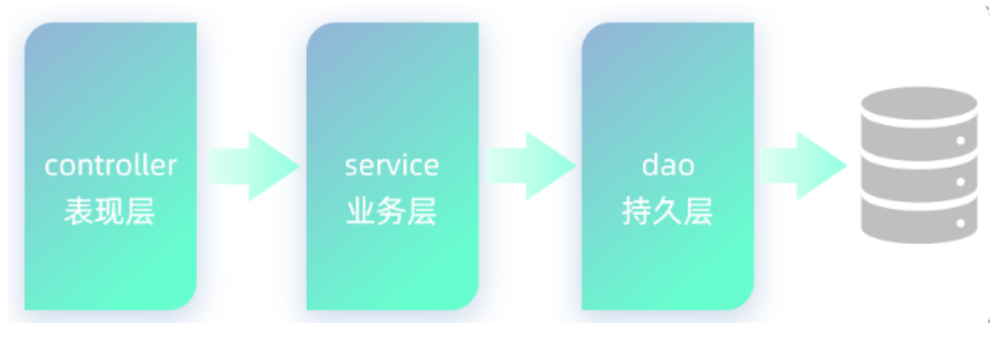

   <a style="font-size:30px;"> Mybatis </a>

   <a href=" " target="_blank"> Demo </a>

# 介绍 
Java程序操作数据库，现在主流的方式是：Mybatis。

MyBatis是一款优秀的**持久层**框架，用于简化JDBC的开发。

持久层：指的是就是数据访问层(dao)，是用来操作数据库的。

使用Mybatis操作数据库，就是在Mybatis中编写SQL查询代码，发送给数据库执行，数据库执行后返回结果。

 

# 2 使用 
## 准备工作(创建springboot工程、数据库表user、实体类User)

## 引入Mybatis的相关依赖，配置Mybatis(数据库连接信息)

## 编写SQL语句(注解/XML)
在创建出来的springboot工程中，在引导类所在包下，在创建一个包 mapper。在mapper包下创建一个接口 UserMapper ，这是一个持久层接口（Mybatis的持久层接口规范一般都叫
XxxMapper）。

# Reference