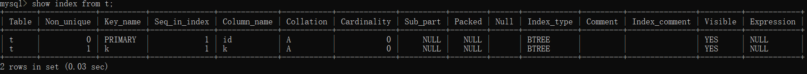
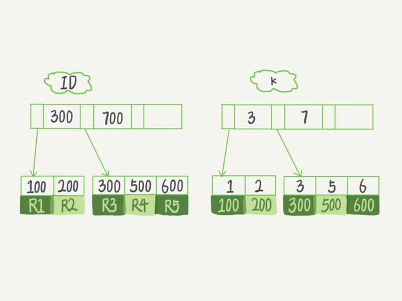

<p align="center">
   <a style="font-size:30px;"> MySQL 索引详解 </a>
</p>

<!-- TOC -->

- [索引模型](#索引模型)
- [MySQL 索引](#mysql-索引)
  - [概述](#概述)
  - [MySQL 中 key、primary key、unique key 与 index 区别](#mysql-中-keyprimary-keyunique-key-与-index-区别)
  - [主键索引和非主键索引](#主键索引和非主键索引)
- [索引维护](#索引维护)
- [Reference](#reference)

<!-- /TOC -->

<p align="center">
   <a href=" " target="_blank"> Demo </a>
</p>

# 索引模型
哈希表、有序数组和搜索树。

目标：降低查询复杂度，减少磁盘 IO……

> 数据库底层存储的核心就是基于这些数据模型的。每碰到一个新数据库，我们需要先关注它的数据模型，这样才能从理论上分析出这个数据库的适用场景。

在MySQL中，索引是在存储引擎层实现的，所以并没有统一的索引标准，即不同存储引擎的索引的工作方式并不一样。而即使多个存储引擎支持同一种类型的索引，其底层的实现也可能不同。

# MySQL 索引
## 概述
在 MySQL 中，无论是 Innodb 还是 MyIsam，都使用了 B+ 树作为索引结构。

>N叉树由于在读写上的性能优点，以及适配磁盘的访问模式，已经被广泛应用在数据库引擎中了。以InnoDB的一个整数字段索引为例，这个N差不多是1200。这棵树高是4的时候，就可以存1200的3次方个值，这已经17亿了。考虑到树根的数据块总是在内存中的，一个10亿行的表上一个整数字段的索引，查找一个值最多只需要访问3次磁盘。其实，树的第二层也有很大概率在内存中，那么访问磁盘的平均次数就更少了。

优点：
1. 提高数据查询的效率，降低数据库的IO成本。
2. 通过索引列对数据进行排序，降低数据排序的成本，降低CPU消耗。
3. 通过创建唯一性索引，可以保证数据库表中每一行数据的唯一性。
   
缺点：
1. 索引会占用存储空间。
2. 创建索引和维护索引需要耗费许多时间。
3. 索引大大提高了查询效率，同时却也降低了insert、update、delete的效率。

## MySQL 中 key、primary key、unique key 与 index 区别

## 主键索引和非主键索引
数据表的主键列使用的就是主键索引。

有一个主键列为ID的表，表中有字段k，并且在k上有索引。
```sql
mysql> create table T(
    -> id int primary key,
    -> k int not null,
    -> name varchar(16),
    -> index (k))engine=InnoDB;
Query OK, 0 rows affected (0.20 sec)

mysql> show index from t;
```


表中R1~R5的(ID,k)值分别为(100,1)、(200,2)、(300,3)、(500,5)和(600,6)，两棵树的示例示意图如下。



主键索引的叶子节点存的是整行数据。在InnoDB里，主键索引也被称为聚簇索引（clustered index）。

非主键索引的叶子节点内容是主键的值。在InnoDB里，非主键索引也被称为二级索引（secondary index）。

根据上面的索引结构说明，我们来讨论一个问题：基于主键索引和普通索引的查询有什么区别？

- 如果语句是 `select * from T where ID=500`，即主键查询方式，则只需要搜索ID这棵B+树；

- 如果语句是 `select * from T where k=5`，即普通索引查询方式，则需要先搜索k索引树，得到ID的值为500，再到ID索引树搜索一次。这个过程称为回表。

也就是说，基于非主键索引的查询需要多扫描一棵索引树。因此，我们在应用中应该尽量使用主键查询。

# 索引维护

<br>

# Reference