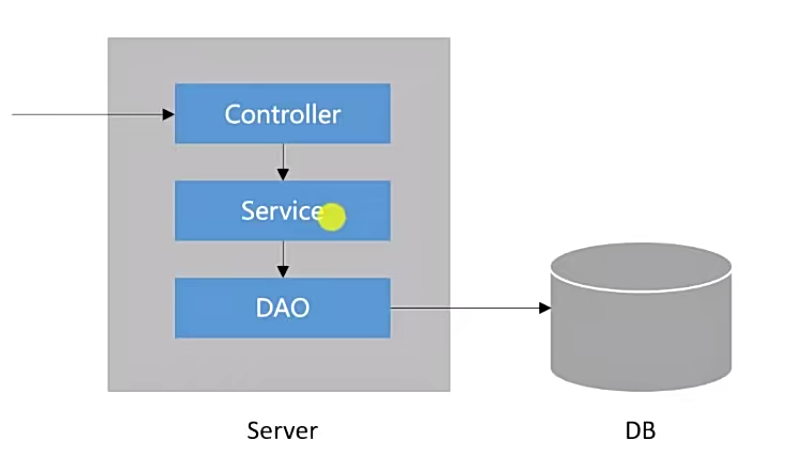

Java Web 开发基础构建和社区首页
<!-- TOC -->

- [概览](#概览)
- [基础构建](#基础构建)
    - [使用Spring Initializr工具快速创建Spring Boot项目](#使用spring-initializr工具快速创建spring-boot项目)
    - [Spring Boot 入门示例](#spring-boot-入门示例)
    - [Spring 入门](#spring-入门)
    - [Spring MVC 入门](#spring-mvc-入门)
    - [MyBatis 入门](#mybatis-入门)
- [社区首页](#社区首页)
    - [概览](#概览-1)

<!-- /TOC -->
# 概览
Java Web开发标准：JavaEE  --ejb（已不用，现用Spring

此项目：侧重服务端


技术架构

Spring Boot（进一步简化Spring）

Spring、Spring MVC、MyBatis

Redis、Kafka、Elasticsearch

Spring Security、Spring Actuator


# 基础构建
## 使用Spring Initializr工具快速创建Spring Boot项目
能够快速添加依赖

Spring Boot框架WEB项目选jar就可以，后期部署可以再用war

没有AOP，解决：在pom.xml中加入依赖
```
<dependency>
    <groupId>org.springframework.boot</groupId>
    <artifactId>spring-boot-starter-aop</artifactId>
</dependency>
```
解决问题2

## Spring Boot 入门示例
Spring Boot核心作用
- 起步依赖
- 自动配置
- 端点监控

示例：

```
@Controller
@RequestMapping("/alpha")
public class AlphaController {

    @RequestMapping("/hello")
    @ResponseBody
    public String sayHello() {
        return "Hello Spring Boot.";
    }
}
```
## Spring 入门


Spring IoC 管理Bean的方法

## Spring MVC 入门
Http等协议:<https://www.ietf.org/>易读：<https://developer.mozilla.org/zh-CN/>

Spring MVC 处理请求响应


## MyBatis 入门
数据库

建表
```
mysql> create database community;
导入建表脚本  注意左斜线
mysql>  use community;
mysql> source d:/MyGitProject/community_s/init_schema.sql;
导入数据
mysql> source d:/MyGitProject/community_s/init_data.sql;
```

MyBatis

在application.properties配置

# 社区首页
## 概览
WEB 项目，浏览器和服务器的交互




