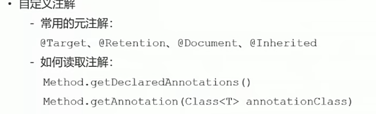

开发社区登陆模块
<!-- TOC -->

- [1 发送邮件](#1-发送邮件)
  - [邮箱设置-启用客户端SMTP服务](#邮箱设置-启用客户端smtp服务)
  - [Spring Email 技术](#spring-email-技术)
  - [模板引擎](#模板引擎)
- [注册功能](#注册功能)
  - [MD5 加盐加密](#md5-加盐加密)
  - [提交注册数据](#提交注册数据)
  - [深入了解一下注册的数据查询存储流程](#深入了解一下注册的数据查询存储流程)
  - [激活注册账号--即验证用户邮箱](#激活注册账号--即验证用户邮箱)
- [检查登陆状态](#检查登陆状态)
  - [拦截器](#拦截器)
- [优化](#优化)

<!-- /TOC -->

# 1 发送邮件
这里遇到了很多问题！！！

自己写通了 。  看下面这个参考

<https://www.baeldung.com/spring-email>

sina账号smtp授权码942215e56795964c  

## 邮箱设置-启用客户端SMTP服务

## Spring Email 技术

## 模板引擎
问题:

2023/12/15

```
 @Test
    public void testHtmlMail() {
        Context context = new Context();
        context.setVariable("username", "sunday");

        String content = templateEngine.process("/mail/demo", context);
        System.out.println(content);

        mailClient.sendEmail("jarenw@163.com", "HTML", content);
    }
```
mail/demo模板中中文显示的是？？？？
2023/12/15已解决 Fix02

---

JavaMailSender 是 Spring 提供的用于发送邮件的接口。
MimeMessage 代表了整个邮件。
MimeMessageHelper 用于帮助构建 MimeMessage，包括设置发件人、收件人、主题和邮件内容。
helper.setText(htmlContent, true); 这行代码设置邮件内容为 HTML 格式。true 参数表示邮件内容应该被解释为 HTML。
MimeMessageHelper 的构造函数中的 "UTF-8" 确保邮件内容使用 UTF-8 编码。

# 注册功能


## MD5 加盐加密

[MD5加密概述，原理及实现](https://blog.csdn.net/Oliver_xpl/article/details/90214896)

```java
 public static String md5(String key) {
        if (StringUtils.isBlank(key)) {
            return null;
        }
        return DigestUtils.md5DigestAsHex(key.getBytes());
    }

```

## 提交注册数据
深入了解一下注册的数据查询存储流程
---
2023/12/15
问题：使用邮件模板引擎出现了问题：模板中中文乱码。在发送邮件时，看到的是"？？？？"
2023/12/15已解决 Fix02

## 激活注册账号--即验证用户邮箱

！！ 重要，写业务的思路

激活成功 

重复激活 提示 不用重复激活 

激活失败  伪造激活码


- 上述各种业务接口的声明 3个常量

写一个接口

- UserService类中实现接口

类中实现 激活方法

- Controller中处理请求

# 检查登陆状态
实现流程：

定义一个注解

在需要检查的方法打上注解

定义拦截器 interceptor，利用反射等机制来检查方法是否被 @LoginRequired 注解标记

如果是的话，就执行相应的登录逻辑。
## 拦截器
在方法前标注自定义注解

拦截所有请求，只处理带有该注解的方法



常用元注解：
@Target

@Retention

通过反射读取注解


# 优化


临时方案验证码使用 session 方案，分布式部署存在 session 共享问题。

临时方案登陆凭证存在 MySQL，访问频次高，性能存在问题。