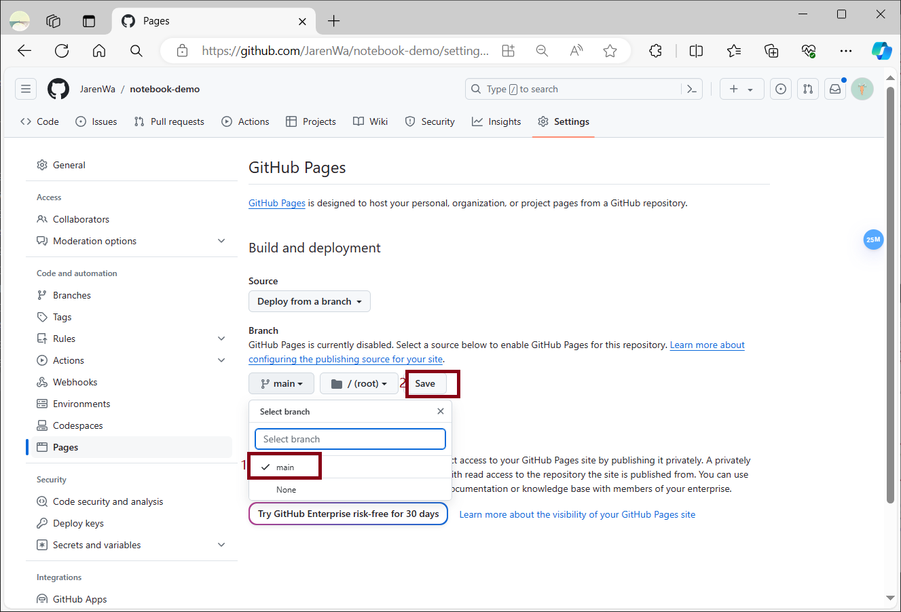

<p align="center">
   <a style="font-size:30px;"> 使用 Docsify + Github Page 打造快捷的轻量级个人文档</a>

</p>

<p align="center">
   <a href="https://jarenwa.github.io/notebook-demo/" target="_blank"> 站点 Demo </a>
</p>

<p align="center">
   <a href="https://github.com/JarenWa/notebook-demo.git" target="_blank"> Github </a>
</p>

# 1 准备工作
## 1.1 安装 [Git](https://git-scm.com/?hl=zh-cn) 
- [Win10环境下Git的配置及使用](https://zhuanlan.zhihu.com/p/455184956)

## 1.2 安装 [Node.js](https://nodejs.org/en)
docsify 框架需要有 npm 工具, 即安装 node.js 可以支持
- [Nodejs 安装教程](https://www.cnblogs.com/goldlong/p/8027997.html)

## 1.3 安装 [Docsify](https://docsify.js.org/)
安装 docsify-cli 工具, 可以方便创建及本地预览文档网站, 直接打开 cmd 窗口执行命令

```bash
npm install -g docsify-cli 
```

<br>

# 2 使用 Docsify 生成文档站点
## 2.1 项目初始化
- 在合适的位置新建文件夹 notebook-demo, 作为项目生成的目录, 打开 cmd 窗口, 进入该目录


- 使用下面命令初始化项目

```bash
docsify init ./docs
```


执行成功后, 目录下生成 docs 文件夹, 包含如下3个文件


我们将在 docs 文件夹存放文档及附件, index.html 为入口文件, README.md 做为主页内容渲染

## 2.2 启动并预览
- 使用下面命令启动项目

```bash
docsify serve docs
```


- 启动成功, 在浏览器打开提示的 URL http://localhost:62284 即可预览

注意: 一般为3000端口, 这里 3000 端口被占用使用了其他端口


- 可以实时预览, 以后编辑文档时, 可以在本地按此方法启动项目, 实时预览效果

<br>

# 3 在 Github Page 部署文档站点

## 3.1 注册登陆 Github 账号, 创建仓库


## 3.2 创建本地仓库, 推送到 Github

- 配置好 git, git 中进入站点目录, 即 D:\MyGitProject\notebook-demo, 执行命令

```bash
git init // 本地初始化一个临时仓库
git add . // 添加所有文件到暂存区, 也就是交给由 git 管理着
git commit -m "first commit" // 提交到 git 仓库, -m 后面是注释
git remote add origin https://github.com/JarenWa/notebook-demo.git // 添加远程仓库 notebook-demo
git push -u origin main // 推送到远程仓库 notebook-demo
```


推送成功


- 我出现的问题

warning:  提示 README.md 和 index.html 行尾的换行符 (line endings) 即将由 LF（Unix 风格的换行符）替换为 CRLF（Windows 风格的换行符）, 这里可以不用处理

error: 由于 git 版本原因, 我的本地仓库默认分支为 master, **要修改为 main**, 因为 github 仓库目前默认分支为 main

```bash
git branch // 确保当前位于本地的 master 分支, 如果在, 列表中显示星号
git checkout master // 如果当前不在 master 分支上，切换到 master 分支
git branch -M main // 本地 master 分支重命名为 main
```
## 3.3 创建 Github Page

- 点击 Settings > Pages, 选择分支 main, 选择 docs文件目录并保存

<!--  -->





- 构造完成后会显示站点 URL, 即可访问


<br>

# 4 补充
## 4.1 如何优化站点
[Docsify 进阶配置](https://clotliu.com/archives/docsify-advanced)
> 持续更新中......
## 4.2 如何高效管理文档结构
> 待更新......


